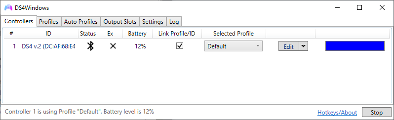
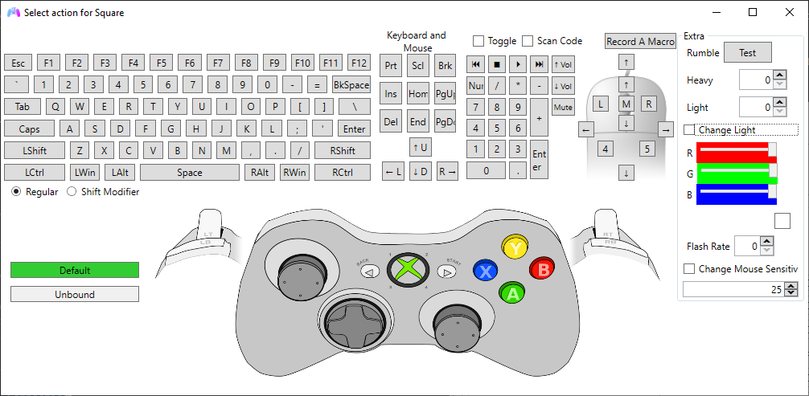

# About DS4Windows

!!! important "Under construction ⚒️"

## Introduction

{: .glightbox } 

DS4Windows is a portable program that allows you to get the best experience while using one of the [supported gamepads](supported-gamepads/) on your PC. By associating your connected controller to one fully remappable virtual Xbox 360 or DualShock 4 gamepad, many more games are accessible.

## Features

=== "Simple & Clean UI"

    Since the idea is to get to get your controller ready for games, The UI was made to make to be quick to pick up. Once first launched, the tool takes your through the setup, gives you a default profile and you're ready to go, or if you choose you can change things to your heart's content.

    {: .glightbox }  

=== "Full controller remap"

    Fully remappable virtual gamepad and keyboard / mouse control.

    {: .glightbox } 

=== "Profile System"

    With profiles, it makes it easier to quickly swap through various settings for your controller. You can set up controls for certain games, or set the lightbar to your favorite color. You can even set button combinations to switch profiles without the need to even open back the program.

    {: .glightbox }  

=== "Automatic Profiles"

    Along with switching profiles manually, you can also switch your controllers to different profiles automatically when certain programs are launched.

    {: .glightbox }  

=== "Lightbar control"

    Set your lightbar to your favorite color, make it reflect the controllers battery level or just go full rainbow mode

    {: .glightbox }  

=== "Many Configuration Options"

    From control mapping, to touchpad sensitivity, to macros, to rainbow lightbar, to motion controls, to special actions triggered by pressing multiple actions, to launching a program with profiles, there are plenty of settings to play around with.

    {: .glightbox }  