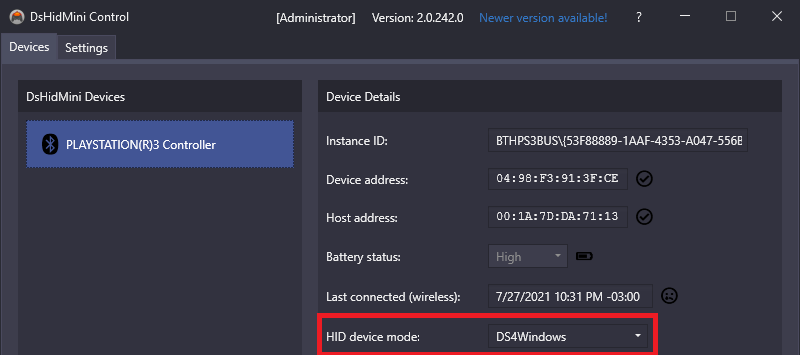

# Supported gamepads

Supported gamepads are the real, physical controllers that can be used with DS4Windows.

## Complete list

This section is dedicated to list all gamepad that DS4Win will recognise as usable and will work as intended. By now DS4Win works with the following gamepads:

| Gamepad | Supported since DS4Window version... | Comment |
| :--- | :--- | :--- |
DS4 v.1 | 1.4.53 | First forked release |
DS4 v.2	| 1.4.53 | The support was added in the original ds4win by Jay2Kings |
Sony Wireless Adapter | 1.4.53 | The support was added in the original ds4win by Jay2Kings
Razer Raiju  | 1.4.99 |
Hori PS4 Mini controller  | 1.4.119  |	
PS4 Fun Controller | 1.7.4	 |
Razer Raiju Tournament Edition | 1.7.8 |	
Razer Raiju Ultimate | 1.7.9	
Steel Play Metaltech P4 gamepad (wired) | 1.7.17 |
Hori Fighting Commander | 1.7.20 |
Nacon Revolution Unlimited Pro | 1.7.20 |
Nacon Revolution Pro v3 | 1.7.23 |
Nacon Revolution Infinite | 1.7.26 |
Astro C40 | 2.1.4 |
Specialist PS4 controllers | 2.1.6 | Three Specialist controllers without identification were added in this version|
SnakeByte Game:Pad | 2.1.8 |
Switch Pro | 2.1.16 |
Switch JoyCon | 2.1.17 |
DualSense | 2.1.17 | Initial support |
Gioteck VX4 | 2.2.2 |
DS3 | 	2.2.10 | Needs to be running under [DsHidMini driver](https://github.com/ViGEm/DsHidMini) and in `DS4Windows Mode` | 

## More info

### DualShock 3

{: .glightbox }  

- **Needs to be running under [DsHidMini driver](https://github.com/ViGEm/DsHidMini) and in `DS4Windows Mode`**
- Requires BthPS3 for Bluetooth connection (covered on DsHidMini [installation guide](https://vigem.org/projects/DsHidMini/How-to-Install/))
- Rumble works as normal, though the small motor has only one strength level
- LEDs can be controller by setting the correct lightbar colors (more on this [here](https://vigem.org/projects/DsHidMini/DS4-Mode-User-Guide/))
- Pressure sensitive buttons not supported
- Motion related functions not supported
- Bluetooth 2.0 + EDR or higher required for wireless connection

### DualShock 4

!!! important "Some of the features described here may not work when a copy-cat/third-party DS4 gamepad is used"

- All controller features are supported except the integrated headphone jack and speaker
- The headphone jack can only be used via USB and only with a DS4v2 (native gamepad function, unrelated to DS4Windows)
- The headphone jack can only be used wirelessly if the controller is connected via [Sony's DualShock 4 Wireless USB adapter](../../accessory)
- Bluetooth 2.1 + EDR or higher required for wireless connection

### DualSense

!!! important "Some of the features described here may not work when a copy-cat/third-party DualSense gamepad is used"

- Most controller features are supported
- The headphone jack and microphone can only be used when used via USB (native gamepad function, unrelated to DS4Windows)
- Adaptative triggers are supported but can only be used in limited forms
- Advanced rumble effects are not used. Rumble acts as common one
- Bluetooth 2.1? + EDR or higher required for wireless connection (necessary confirmation)

### Joy-cons

- ?LEDs cannot be controlled?
- HD Rumble not used. Rumble acts as common one
- Motion sensors are supported
- Can be used in joined or split mode
- NFC not supported
- Because the ZR and ZL are buttons and not triggers it may be difficult to play games that make use of analog triggers
- Bluetooth 2.1? + EDR or higher required for wireless connection (necessary confirmation)

### Pro Controller

- ?LEDs cannot be controlled?
- HD Rumble not used. Rumble acts as common one
- Motion sensors are supported
- NFC not supported
- Because the ZR and ZL are buttons and not triggers it may be difficult play games that make use of analog triggers
- Bluetooth 2.1? + EDR or higher required for wireless connection (necessary confirmation)

## Regarding non-supported controllers

!!! important "Under construction ⚒️"

### Replicas/copy-cats that are not in the list

- If a gamepad is made to be a complete replica of a official one (acts exactly as the original and appear to Windows as such) then chances are DS4Windows will just detect it as being the official controller and it __may__ just work (no guarantees though)
    - __Example:__ 8bitdo controllers that are compatible with Nitendo's Switch usually present themselves as a replica of the Pro Controller and can be used as normal with DS4Windows.
- For cases where the gamepad presents itself differently than the official one to the system (most DS4 replicas) then DS4Windows will not recognize them. DS4W detects controller by their **V**endor and **P**roduct **I**dentification (VID/PID), so if a controller's VID/PID is not already on DS4W code then it will just be ignored
    - Adding support to new copy-cats may be as easy as just adding their VID/PID to the code or as hard as making major changes to the internal structures of DS4Windows, so it's not feasible to add support for every single controller out there
    
!!! note "To Do: add info on how to request for a 3rd party controller to be supported"

### Xbox controllers

Not currently supported.

