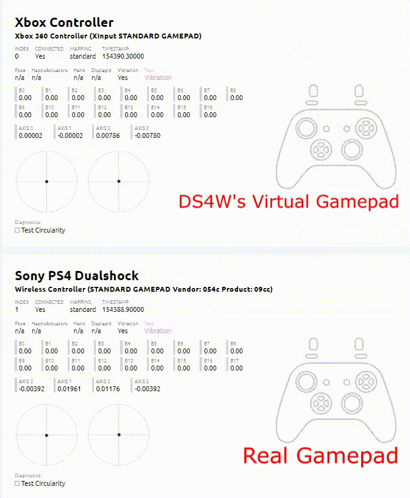

# Frequently Asked Questions

## Does DS4Windows supports only PS4 controllers?

The [_Supported Gamepads_ page](../../about-ds4windows/supported-gamepads/) will better answer this question for you.

Keep in mind that the real controller you are using is not that important for game compatibility. As long as it is detected by DS4Windows, you'll be using them as either a Xbox or DS4 gamepad via gamepad emulation.

## How does this program works?

### Newbie explanation

DS4Windows works by remapping the user's __"real"__ gamepad into a new, __virtual / "fake" / emulated__ gamepad (check the GIF below) or by directly mapping the real gamepad to the user's keyboard and mouse. This allows:

- Using your gamepad in games that support (for example) only Xbox controllers
    - It's possible to emulate either a Xbox or DS4 gamepad, but keep in mind that most games do not support DS4 controllers in any way, requiring Xbox emulation
    - The virtual controller is fully configurable: its buttons and sticks can be remapped to other buttons/sticks or entirely disable, their behavior tweaked , special functions configured etc.
- Using your DS4 via Bluetooth in games that only recognize DS4 controllers connected via USB (Wired v1 DS4 emulation)
- Playing games that do not support gamepads by controlling the PC's keyboard and mouse
- Mapping the controllers motion sensors to control the mouse, sticks etc.
- And much more!

!!! info "GIF showcasing DS4Windows virtual controller in action"

    {: .glightbox }

### Why games think I'm using a Xbox controller?

When using DS4Windows, the real controller that you are using is mostly of no importance. What matters is the type of controller emulation set on the currently active profile (Virtual Controller Settings).

On default settings DS4Windows is set to emulate Xbox controllers since most games support only this type. __Though it's possible to change to DS4 emulation in the profile settings, KEEP IN MIND THAT MOST GAMES DO NOT DIRECTLY SUPPORT DS4 CONTROLLERS AND XBOX EMULATION IS REQUIRED!__

For some more info on games not recognizing DS4 controllers, check the [_games not recognizing DS4 controllers_ troubleshooting page]().

### Emulated / Virtual controller? What is this?

As the name suggests, it's a fake / virtual / non-physical controller.

DS4Windows cannot "transform" the real controller you are using from one type to another, so instead it associates it to a new virtual controller in the system from the desired type.

On default settings, the virtual controller is a Xbox 360 to ensure maximum game compatibility and it replicates the movements done by the real controller as if the user were directly using it.

### What's the advantage of using virtual controllers?

The main advantages are:

- Virtual controllers are recognized as "real" by the system. As such, they work in any game or application on the system that has support for them
    - This does not magically add gamepad support to games that do not have them or support only one type of controller. If a game works only with Xbox gamepads then you NEED to do Xbox emulation, since the game would not recognize the gamepad if you were to emulate a DS4 
- A game may have fixed control schemes, but the user wants to rebind a function from one button to another. By directly rebinding the virtual controller's button on DS4Windows the user completely bypass the game's limitation

These are just examples, keep in mind that DS4Windows is a powerful tool that can be heavily customized to the user's preferences, as such it's hard to properly summarize what can and cannot be done.

### Why would I emulate a DS4 controller if I'm already using one?

DS4Windows can emulate a DS4v1 connected via USB. This is useful when:

- You want to rebind buttons, adjust the sticks behavior etc when using a real DS4 (or any other controller)
- a fake/copy-cat DS4 controller is being used which the game may not recognize as an actual DS4
- Your controller is connected wirelessly but the game you want to play only has (full) support to wired, version 1 DS4 controllers
	- DS4Windows' virtual DS4 controllers are always wired/v1, regardless to the real controller being used and how it's connected
- Your real, physical DS4 is hidden, meaning the only way to use it with games as an actual DS4 controller is by emulating a new one
	- "Hiding" the physical controllers being used with DS4W from the system is a recommended step to prevent issues with games. For more information, check the [_Preventing the double controller / double input issue in games_ page](../../guides/solving-double-input/)

### If DS4W creates a new gamepad on my system doesn't this means I end-up with 2 controllers, the real and the virtual?

Yes. This can lead to an infamous problem called _double input issue_. Fortunaly, this can be solved by "hiding" the real controller being used, leaving only the virtual one visible to games and applications.

Check the [_Preventing the double controller / double input issue in games_ guide](../../guides/solving-double-input/) for more info on this.

### Can I emulate other controllers besides Xbox and DS4?

DS4Windows is limited to the types of virtual controller the ViGEmBus driver can create, and for now it can only spawn virtual Xbox and DS4 controllers. This may change in the future but there is no estimate.

## I'm having some kind of issue, how do I solve it?

The [Troubleshooting section of this site](../../troubleshooting) Is made to direct users to the info they need to "help themselves". Be sure to look around carefully as most known issues are already covered there somewhere, all it takes is some reading and comprehension skills and a bit of patience.

### I did not find how to solve my issue on the site, how do I request for direct support?

??? info "To Do - Under consctruction"

    Keep something in mind: support is only given to users that can PROVE they actually followed all applicable troubleshooting sections but still couldn't fix this problem. As such, there is a template that the user is required to fill with lots of info and images to base their claim that their issue is something that is not covered or really unexpected.

    __USERS THAT DO NOT PROVIDE THE REQUIRED INFO WILL HAVE THEIR SUPPORT TICKETS IMMEDIATELY CLOSED!__ If you've read and understand that, then please click only on the final dot of the following link:

    [Direct support page](../../other/under-construction)[.](../../other/under-construction)

## Why isn't rumble working when doing DS4 emulation?

!!! important "TL;DR: Virtual DS4 rumble has been disabled"
	- Rumble is disabled when using a __VIRTUAL__ DS4 controller, regardless of the type of real controller being used
    - Rumble is working as normal if using a real DS4 controller and Xbox emulation

There is an issue with the ViGEmBus's virtual DS4 controllers where it doesn't correctly register if a game wants to activate __only__ the rumble or __only__ change the lightbar color. Depending on how the game is coded to manage these functions, this may cause the rumble to never stop or the lightbar to change to the wrong color.

Because of motives above and the fact that this is something unfixable by DS4Windows, the rumble and lightbar passthru functions were disabled until the next version of the ViGEmBus is released, with no estimate for when this will happen.

## What's the differences between using a controller with DS4Windows and using it with Steam Input?

The main difference is that for Steam's controller support to work every game or application need to be launched __through__ Steam, since it needs to directly intercepts the game's controller communication. On the other hand, DS4Windows' virtual controllers behave as real ones on the system and will work in any game or application that has support to them, _including_ Steam games.

Both tools have the same main functions while also having their own extras. In the end, the users themselves need to learn what both tools can do and how to properly use them to decide which one is better for their use case. 

## Can I use the headphone jack port of a DS4 or DualSense controller on a PC?

Only when connected via USB (official DS4v2, DualSense and some fake DS4) or when connected over Sony's official USB Wireless Adapter (DS4 controllers)

For more info: [Headphone or mic related issues when using supported gamepads](../../troubleshooting/audio-related/).

### Will DS4Windows add suport for DS4/DualSense's headphone jack when connected via the standard Windows Bluetooth?

Is it possible to implement this? Apparently yes. ___WILL___ it be implemented? The answer is probably **no** unless some new developer steps in to specifically focus on this.

What most users don't understand is that:

- DS4Windows is a free, open-source software developed by a few people out of their own limited free time. Have you ever had to work, study, have fun _and still have time left to work on non-paid software for random internet users?_ Balancing all these things is not an easy task
- Even minor things can be complicated to be implemented. Audio input/output over Bluetooth is complicated, specifically because there is a LOT that is not known for the lack of documentation, so sometimes it takes way too many hours of work just to __test__ something
- There are other more important things to focus that actually impact gaming. if users need wireless headsets they can just buy a dedicated one. As such, this niche feature is really low on the _To Do_ list

### Why does my speakers / headphones audio stop working when I connect my controller to the PC?

 You are probably connecting a controller that has headphone jack audio support and Windows is automatically switching to it.

When this happens, the user needs to manually switch back to the preferred audio device on apps being used and on Windows itself.

Check the [_Headphone or mic related issues_ troubleshooting page](../../troubleshooting/audio-related).
