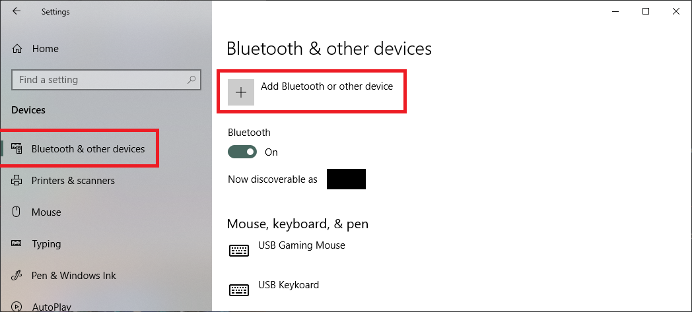

# Connecting controllers to the PC and DS4Windows

## General info

DS4Windows should immediatly recognize any controllers properly connected to the PC.

Though USB cables are the most reliable, connecting controller wirelessly via Bluetooth will offer similar response times (input delay) and stable connections as long as a good quality BT adapter is being used and no major radio interference is affecting the connection.

If facing issues, either when connecting wired or wirelessly, then have a look at the related links at the bottom of the page.

## Connection methods

### USB

- Should be as simple as just plugging your controller with a good, working USB cable
- Windows should play a "device has been detected" sound when the controller is plugged in
- Keep in mind that some USB cables can only be used for charging. If the cable does not support data transfer then it won't be of use

### Bluetooth

!!! important "Most of what is written here does not apply to DualShock 3 controllers. If using one, be sure to follow it's [dedicated guide](https://vigem.org/projects/DsHidMini/How-to-Install)"

- Make sure your BT adapter has the [minimum specs](../../other/under-construction) for your controller
- The controller needs to be set into `pairing mode` to be added as a Bluetooth device through Windows' settings. If a pin is asked try `0000`
- If a controller has already been previously paired and you can't reconnect, try removing the device from Windows' Bluetooth devices list and repairing them

{: .glightbox }

!!! info "Setting a controller into pairing mode"

	=== "DualShock 4 / DualSense"
		
		Hold at the same time the `PS + Share` buttons until the lightbar starts flashing in a heartbeat  pattern.

		{: .glightbox }

	=== "Joy-con / Pro Controller"	
		
		Hold down the `sync` button until the controller LEDs enter a back n' forth pattern.

		{: .glightbox }
	
	=== "Copy-cats / replicas"
	
		- Probably the same as the official ones
		- If facing trouble, check the controller's manual

### Sony DualShock 4 USB Wireless adapter

The official adapter from Sony supports only 1 controller, but allows the headphone jack to be used wireless for both audio and mic.

To pair a DualShock 4 to it, both must be set to pairing mode. For the Wireless Adapter, its main body must be slightly pressed towards the USB port (until a "click" is felt) then hold it down in this position for 3 seconds, with its LED flashing in a heartbeat pattern indicating that it's in pairing mode. Set then DualShock 4 into pairing mode (check the previous section) and it it should connect to the adapter.

{: .glightbox }

## Final checks

Assuming everything is working as expected then DS4Windows should have no trouble detecting your controller, just make sure you haven't accidentally stopped DS4Windows (in case you have, just press DS4Windows' `start` button)

If for whatever reason DS4Windows is failing to detect your controller or you are not sure if it has been properly connected, check the [Controller Detection troubleshoot](../../troubleshooting/ds4w-controller-detection/) page.

## Related links

- [Supported controllers](../../About-DS4Windows/supported-gamepads/)
- [Controller Detection troubleshoot](../../troubleshooting/ds4w-controller-detection/)
- [Bluetooth adapter minimum specs](../../other/under-construction) 
- [Bluetooth connection issues troubleshoot](../../troubleshooting/bt-connection-issues/)
- [Lantecy or input delay issues on Bluetooth](../../troubleshooting/input-delay-bt/)
