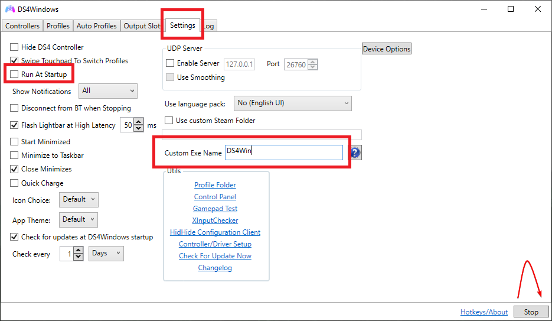
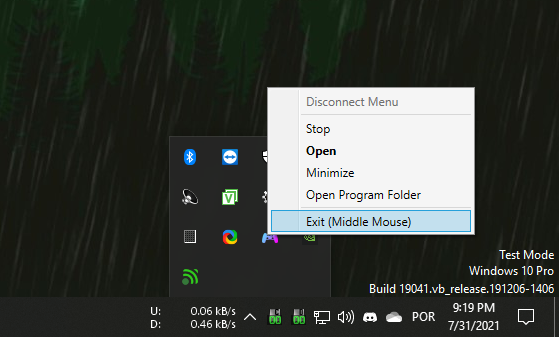
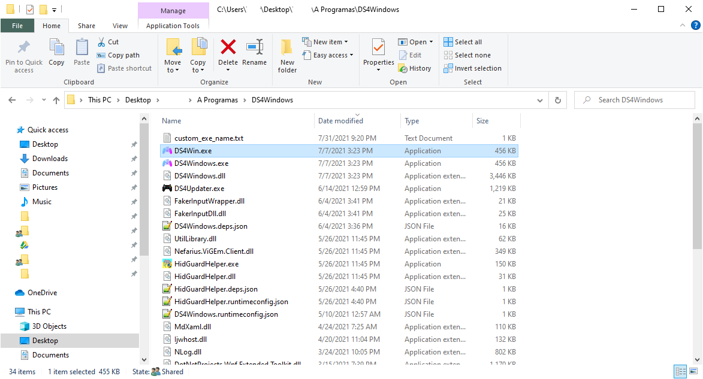
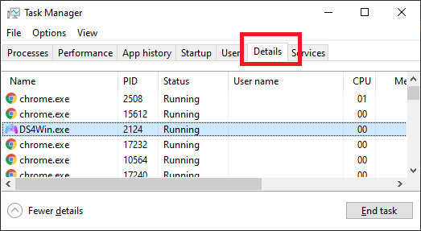

# Running DS4Windows under a custom ".exe" name

## General info

There are some applications and games that behave differently when they detect DS4Windows is running on the users system. The known ones are:

- Steam Big Picture: cannot interact with the Big Picture interface using PlayStation controllers (DS4/DualSense)
- Steam Input: will ignore PlayStation controllers, breaking their usage with Steam's `Playstation Configuration Support`
- Yuzu/Cemu emulators: will ignore PlayStation controllers
- Shovel Knight: game will ignore DS4 controllers

This guide will make DS4Windows run under a new process name instead of the standard `DS4Windows.exe` in order to make it run undetectable.

## How to...

### Set a custom ".exe" name

The name `DS4Win` will be used as an example for this guide, but any other name can be used:

!!! info "Necessary to follow step-by-step"

    === "Part 1"

        1. Open DS4Windows and go to the `Settings` tab
        1. If the `run at Startup` option is enabled then disable it for now
        1. On the `Custom Exe name` box write the desired custom name (DS4Win) without adding ".exe" in the end
        1. Stop and then start DS4Windows again

        {: .glightbox }  

    === "Part 2"

        1. Fully close DS4Windows, make sure it's not running on the background or in the system tray

        {: .glightbox }  

    === "Part 3" 

        1. On DS4Windows' folder, locate the new `TheNameYouChose.exe` (DS4Win.exe) file and execute it

        {: .glightbox }  

    === "Final check and remarks"

        - To check if everything is alright, press `Ctrl + Shift + Esc` top open Windows' Task Manager, go into the `Details` tab and confirm that `TheNameYouChose.exe` ("DS4Win.exe") is running instead of `DS4Windows.exe`. Cheers!

        {: .glightbox }  

        - From this point forward the original `DS4Windows.exe` should not be used anymore
        - If the `run at Startup` option has been disabled in the beggining then re-enable it now
        - Sometimes this process needs to be re-done after a DS4Windows update, though DS4Windows updates should work as long as the name inside the `Custom Exe name` box is exactly the same as the actual ".exe" file (not including the actual ".exe" text)        

### Stop using a custom ".exe" name

1. Fully close DS4Windows in case it is open. Make sure it's not running in the background or at the system tray
1. Open the original `DS4Windows.exe` file
1. If the `run at Startup` option is enabled then disable it for now
1. Erase the name inside the `Custom Exe name` box
1. Stop and then start DS4Windows again
1. If the `run at Startup` option has been disabled in the beggining then re-enable it now
