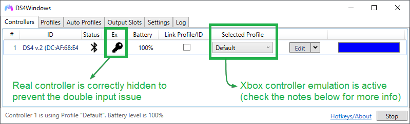

# Starting point, general info and directions

!!! important "Under construction ⚒️"
    Check the side bar on the left for more info.

## Main steps for correctly using DS4Windows

1. Downloading, running and getting your gamepads detected by DS4Windows
	1. [_Installation and Setup_ guide](../guides/install-setup/)
	1. [Correctly connecting gamepads to the PC](../guides/)
1. "Hiding" the real gamepads being used so only DS4Windows' virtual controllers remain visible to games in order to prevent the infamous _Double Controller or Double Input Issue_
	- This is __THE__ major recomendation to be followed in order to prevent problems in games
	- Check the [_Preventing the double controller / double input issue in games_ guide](../guides/solving-double-input) for more info about the issue and instructions on how to proceed

{: .glightbox }

## Important remarks

??? info "About the `Default` profile (click to expand)"

	- Xbox 360 emulation is the default mode: your gamepad will be recognized as if it were an Xbox 360 controller by the system and games
	- DS4/DualSense's touchpad is set for mouse control
		- To quickly turn off or on this feature you can hold the `PS` button then touch the Touchpad once
    ---------
    Check the _Customization_ section for more info on how to create, edit and fine tune profiles so you can effortlessly switch to different configurations by switching between profiles
        
??? important "About DS4 controller emulation (click to expand)"

    - __Though it's possible to change from Xbox to DS4 emulation, keep in mind that most games support only Xbox gamepads!__ If the game itself doesn't have native support for DS4 controllers then your gamepad won't be detected if you switch to DS4 emulation 
        - To switch to DS4 emulation you can create a new profile using a `Gamepad -> DualShock 4` preset or edit an existing profile and then change the `Virtual controller settings` in the profile editor's `Other` tab
    - Rumble is currently disabled when emulating a DS4 controller
        - __Do not confuse things:__ using a real DS4 while doing Xbox emulation will have rumble working as normal. Using _any_ real controller + DS4 emulation will have rumble disabled

??? important "About the `Output Slots` tab (click to expand)"

    It's better that nothing is changed on this tab unless you __really__ know what you are doing. The default configurations (everything set to dynamic) is the better choice for most users.

## What to do when facing an issue

The [troubleshooting section](../troubleshooting) of this site has guides and general directions on how to solve most the commons issues users may face when using DS4Windows.

## Customizing 

!!! info "Under-construction"
