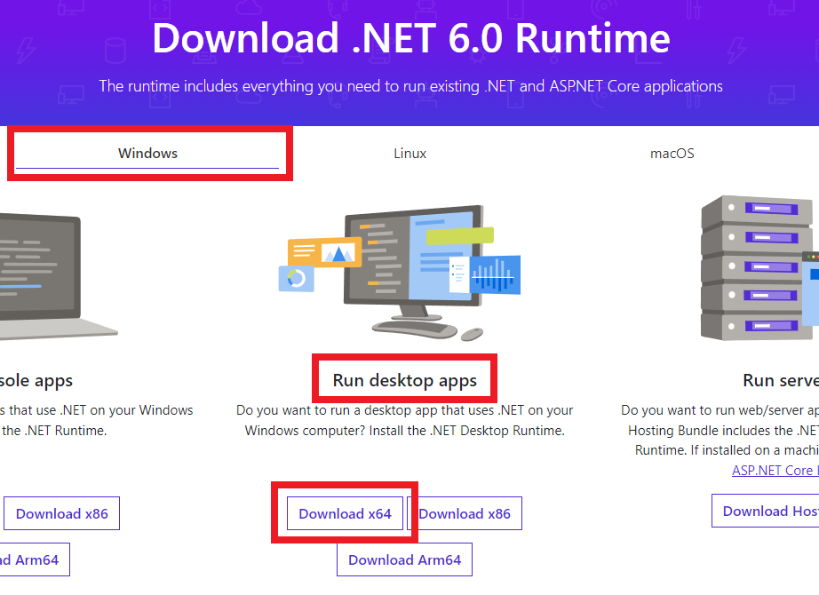
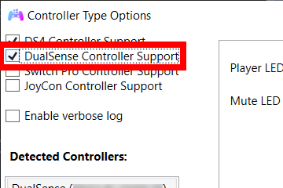
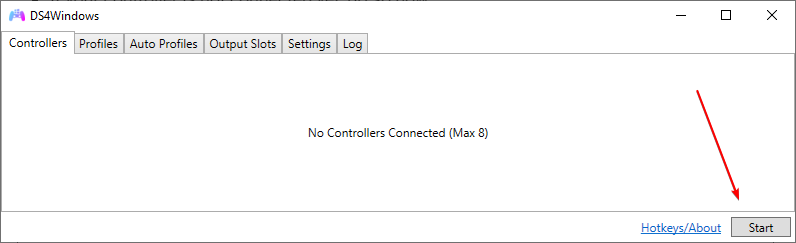
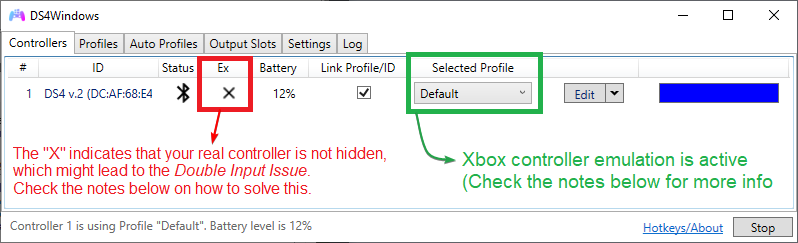

# Installation and Setup

!!! important "Know your system architecture"
    Most users have a x64 (64 bits) system and this guide was built around this fact. If you are using a [x86 (32 bits) system](../../other/how-to-check-architecture/) then use the x86 equivalents of drivers, packages etc

## Prerequisites

- Windows 10 or 11. __Windows versions from 8.1 and below are NOT supported anymore and support will not be given to users running older builds__
- One or more supported controllers ([check the list](../../About-DS4Windows/supported-gamepads/)) 
- (__Optional__) Bluetooth dongle for connecting wirelessly
- Download and install the [x64 .NET 6.0 Runtime](https://dotnet.microsoft.com/download/dotnet/6.0/runtime) __FOR DESKTOP APPS__
{: .glightbox }  

## Downloading and starting DS4Windows

- [Download the latest ------> __x64, .zip__ <------ DS4Windows package](https://github.com/Ryochan7/DS4Windows/releases)
    - The .7zip package is smaller but requires the [7zip](https://www.7-zip.org/) software in order to open/extract it
- Extract the package in a easily accessible folder (e.g.: Desktop, Documents, Download etc)
    - __DO NOT__ extract it inside a folder the requires elevated privilegies (e.g.: Program Files, Windows)
- Execute the `DS4Windows.exe` file to run DS4Windows
- On first launch DS4Windows may ask you where to save its user data (settings and profiles):
    - __AppData folder (recommended)__: user data is stored outside of the program folder, inside a special folder reserved to your Windows user
    - __Program folder__: user data is stored inside the same folder `DS4Windows.exe` is located

## Enabling DualSense controller support

- Open the `Settings` tab and click on the `Device Options` tab
- Now enable the `DualSense Controller Support` checkbox

{: .glightbox }  

## Drivers setup

When running DS4Windows for the first time it may prompt you to install some drivers, with the first one being essential. Install them accordingly to your needs then hit the `Finished` button after.

| Driver | Recommended? | Driver function |
| :--- | :--- | :--- |
| __ViGEmBUS__ |  __REQUIRED__ | Allows DS4Windows to create virtual Xbox/DS4 controllers |
| __HidHide__ | __Strongly recommended__ | Used to "_hide_" your real controller in order to prevent games from simultaneously recognizing both your real controller and the virtual controller created by DS4Windows, a situation that can lead to the infamous [double controller input issue](../solving-double-input) |
| __FakerInput__ | Optional | Useful for users who want to use their controllers as keyboard and mouse. Though DS4Windows can do so by itself, the FakerInput has better performance and can work in more games and situations where Windows might prevent the usage ofDS4Windows' normal keyboard/mouse handler   |

## Final steps

- If your controller is not connected yet, do so now
    - Check [here](../../guides/connecting-controllers/) if you are having trouble connecting them via bluetooth
- If everything is _ok_ then your controller will appear on the main `controllers` tab with the `Default` profile selected
    - Make sure DS4Windows is not stopped
    - Check [here](../../troubleshooting/ds4w-controller-detection/) if DS4Windows has not detected your controller

{: .glightbox }  

{: .glightbox } 

Assuming your controller has been detected then Xbox Controller emulation should already be working! Before playing, it's recommended to read the information below in order to prevent issues and to gain general knowledge on DS4Windows functions:

!!! fail "About the "X" check on the `Ex` column"
    - If the "X" check is present, then you may suffer from the infamous _Double Input Issue_ which might cause several gameplay problems
    - Follow the [_Preventing the double controller / double input issue in games_ guide](../../guides/solving-double-input) to hide your real controller

!!! important "Important things to know"
    Check the [_Important remarks_ section on the main "guides" page](../#important-remarks) for some nice info on how DS4Windows works and general directions.

## Having problems? Look here!

The [troubleshooting section](../../troubleshooting) of this site has guides and general directions on how to solve most the commons issues users may face when using DS4Windows.
