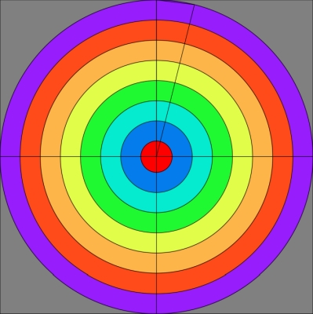

# Axis config

!!! important "Under construction ⚒️"

Dead Zone and Anti Dead Zone

!!! info inline "INPUT: Real Control. Stick"

    !!! hint "Dead Zone selecion"

    === "0.00"

        {: .glightbox } 

    === "0.10"

        {: .glightbox } 
       
    === "0.20"

        {: .glightbox } 
       
    === "0.40"

        {: .glightbox } 
       
    === "0.60"

        {: .glightbox } 
       
    === "0.80"

        {: .glightbox } 
     

!!! info inline end "OUTPUT: Virtual Control. Stick"

    !!! hint "Anti Dead Zone selecion"

    === "0.00"

        {: .glightbox } 

    === "0.10"

        {: .glightbox } 
       
    === "0.20"

        {: .glightbox } 
       
    === "0.40"

        {: .glightbox } 
       
    === "0.60"

        {: .glightbox } 
       
    === "0.80"

        {: .glightbox } 

- When the **Input** is inside the Dead Zone (red area) the **Output** (resulting position) is perfectly centered (or _zeroed_ in case it's trigger instead of a stick) 