# Preventing conflicts between Steam and DS4Windows

## General info 

Besides being a game store, Steam also has controller remapping functions (Steam Input). Since you are already using DS4Windows as your controller remapping tool, _re-remapping_ DS4Windows' virtual controller via Steam Input can lead to confusion at best ("which tool is doing what?") and actual conflicts at worst (each one doing something different for the same button/axis).

Therefore, it's recommended that the user tweaks some Steam (or DS4Windows) settings to prevent remapping conflicts.

Moreover, Steam alters its behavior if it detects DS4Windows is running. Though this usually DOES NOT affect controller detection in games or cause any sort of "grave" issue, it will:

- Prevent the user from interacting with Steam's Big Picture interface when using a virtual DS4 controller
- Not allow the user to use virtual DS4 controllers through Steam Input
    - Which makes no difference for the vast majority of games, but may be needed for a few specific titles that require Steam Input for having native Playstation Controllers support

## Recomendations

!!! important "Preventing reemapping conflicts"
	
	In order to prevent remapping conflicts:
	
	- The major recommendation is following the "**Fully disabling Steam remapping functions**" section in this page so only DS4Windows' remapping functions are used

	- In case the user needs to use both DS4Windows and Steam Input at the same time, the "**Using DS4Windows + Steam Input (DS4Windows as the main remapper)**" instructions will guide them on how to do so

!!! info "Situational: Big Picture mode with emulated DS4 controllers"

	- If the user wants to use Steam's Big Picture while emulating DS4 controllers then it's required that [DS4Windows is run under a custom ".exe" name](../../guides/ds4w-custom-name/), otherwise the Steam interface will ignore every PS controller in the system
        - If the user has not [hidden their real controller in order to prevent the double input issue](../../guides/solving-double-input/) they WILL SURELY suffer from double input in the Steam interface AND in-game depending on Steam's controller settings

### Situations where using DS4Windows + Steam Input is necessary

**Usually using Steam Input along DS4Windows is not necessary and the user will have no problems with just using DS4Windows default configuration and disabling every Steam remapping function as instructed in this page.**

Still, the few situations where it might be required are:

- Using a very specific Steam remapping function which an equivalent does not exist on DS4Windows
- Using Steam's "Xbox Config. Support" when emulating Xbox controllers to prevent the [incorrect XInput Slot issue](../../troubleshooting/xinput-slots-order/), as Steam can directly hijack the XInput Slots order for games launched through it
    - This is usually not necessary for most users
- Using Steam's "PlayStation Config. Support" when emulating DS4 controllers for the few games that only have PS controller support _through_ Steam Input
    - **STEAM CANNOT MAGICALLY ADD DS4 SUPPORT TO GAMES THAT DON'T HAVE IT**. If a game does not have native DS4 support and you use a emulated DS4 controller + Steam's "PS Config. Support" them Steam will probably just emulate a Xbox controller for the game anyway
    - This also requires [running DS4Windows under a custom ".exe" name](../../other/under-construction) since otherwise virtual DS4 controllers won't be detected by Steam controller list

## Instructions on how to prevent remapping conflicts

### Recommended

??? check "Fully disabling Steam remapping functions (click to expand)"

    === "Part 1"

        1. Open Steam Settings -> controllers section

        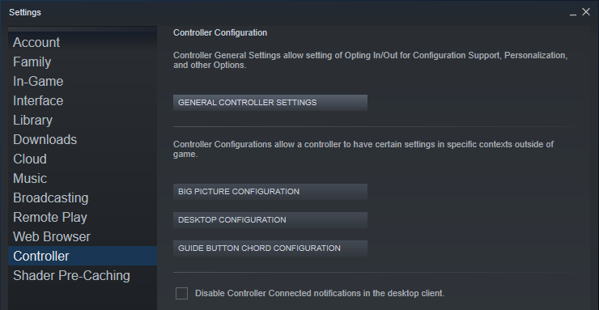{: .glightbox } 

    === "Part 2"

        1. Select the **General controller Settings** option
        1. **DISABLE** the "Xbox Configuration Support" options
        1. **DISABLE** the "PlayStation Configuration Support" options

        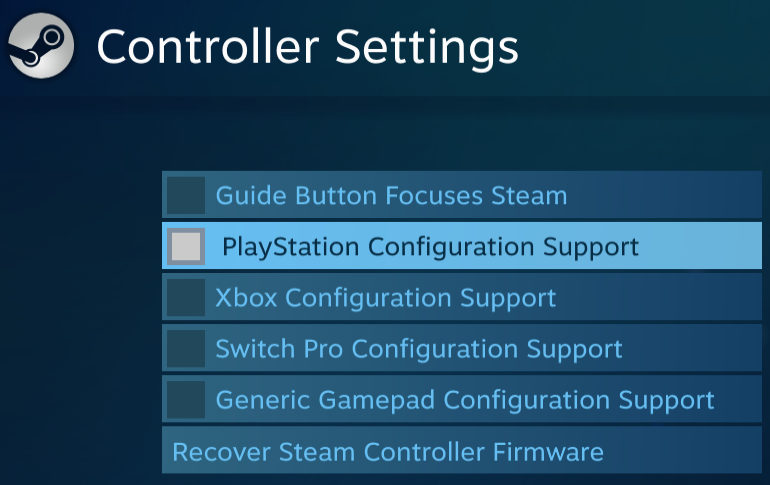{: .glightbox }                

    === "Part 3"

        1. Get back to the Steam' Settings window -> Controller section
        1. Go into the "**Guide Button Chord Configuration**" option
        1. Manually un-bind/remove/disable every setting so your settings looks like the following image
            - You might need to execute this 2 times: once when emulating a Xbox controller and another when emulating a DS4
            - The image might be different depending on if you are emulating an Xbox or DS4 controller

        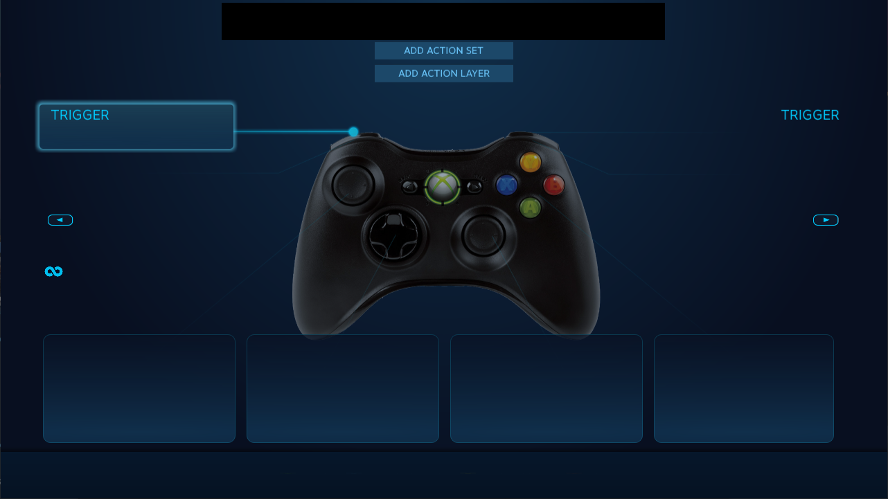{: .glightbox } 

    === "Final remarks"

        - Disabling Steam's Xbox/PS Config. Support settings + manually unbinding every action in the "Desktop Configuration Settings" is enough to fully disable Steam Input
        - The "Big Picture Configuration Settings" can be freely tweaked to your likings, just remember to consider how DS4Windows' virtual controller is set in case you are not using a Default/Preset profile

### Other

??? check "Using DS4Windows + Steam Input (DS4Windows as the main remapper)"

    === "Info"

        !!! info "For who this configuration might apply"

            Check the "Situations where using DS4Windows + Steam Input is necessary" **SECTION** in this page for more info.

        !!! info "Purpose of this configuration"

            - Disable every steam function that allow Keyboard and Mouse control
                - Those functions must only be executed by DS4Windows
            - Make sure that Steam does not mess with controller buttons/axis in-game in order for whatever remapping is done by DS4Windows to "passthrough" Steam's remapping without interference

    === "Part 1"

        1. Open Steam Settings -> controllers section

        {: .glightbox } 

    === "Part 2"

        1. Select the **General controller Settings** option
        1. Enable the "Xbox Configuration Support" options
        1. Enable the "PlayStation Configuration Support" options

        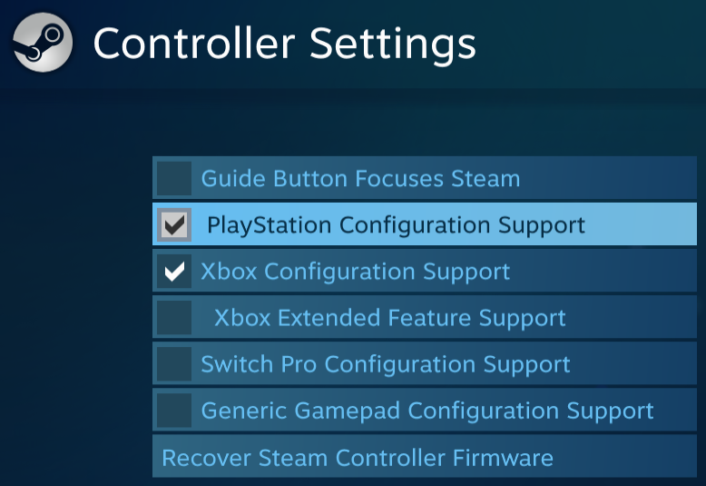{: .glightbox } 

    === "Part 3"

        1. Get back to the Steam' Settings window -> Controller section
        1. Go into the "**Guide Button Chord Configuration**" option
        1. Manually un-bind/remove/disable every setting so your settings looks like the following image
            - You might need to execute this 2 times: once when emulating a Xbox controller and another when emulating a DS4
            - The image might be different depending on if you are emulating an Xbox or DS4 controller

        {: .glightbox } 

    === "Part 4"

        1. Get back to the Steam' Settings window -> Controller section
        1. Go into the "**Desktop Configuration**" option
        1. Manually un-bind/remove/disable every setting so your settings looks like the following image
            - You might need to execute this 2 times: once when emulating a Xbox controller and another when emulating a DS4
            - The image might be different depending on if you are emulating an Xbox or DS4 controller

        {: .glightbox } 

    === "Final remarks"

        !!! important "Any type of controller customization must be done through DS4Windows to prevent issues"

            - In case you had previously changed controller settings inside Steam options you can revert to the standard Steam configuration by:
                1. Going in-game
                1. Opening the Steam overlay
                1. On the overlay opening Steam's controller configurations
                1. "Browse Configs"
                1. Selecting a recommended standard gamepad layout

??? caution "Using DS4Windows + Steam Input (Steam Input as the main remapper)"

    === "Info"
    
        !!! info "For who this configuration might apply"

            Useful for those that want to use Steam's remapping functions while also using DS4Windows for non-Steam games, but also don't want to un-hide their **real** controller everytime they want to use it with Steam

        !!! info "Purpose of this configuration"

            In this configuration, DS4Windows will basically "do nothing" besides passthru information (as accurately as possible) between Steam and the real controller through its virtual controller

        !!! bug "Issue warning"

            - Currently, the **Lightbar Passthru mode** and **controller rumble** are directly **DISABLED** on DS4Windows code when emulating a DS4 controller because of an currently impossible to solve issue
                - The issue could cause controllers to not stop rumbling or the lightbar to change to incorrect colors than what the game requested
                - It can't be currently solved because it's an issue with the ViGEmBus, used by DS4Windows to spawn virtual Xbox/DS4 controllers. Until the ViGEmBus itself fixes this issue DS4Windows cannot re-enable these functions

    === "Part 1"

        1. Verify on DS4Windows' Log tab which version you are using
        1. Download the following pre-made profile archive accordingly to your DS4Windows version:
            - For DS4Windows v3.0.18: [DS4 Total Passthru](https://github.com/CircumSpector/DS4WDocs/files/7402123/DS4.Total.Passthru.-.DS4Windows.3.0.18.profile.zip)
        1. Extract the profile file (.xml) from inside the archive to a folder of your choice
        1. On DS4Windows' profile tab Import the extracted profile
        1. Select the "DS4 Total Passthru" profile for your controller in the main "controllers" tab
        
        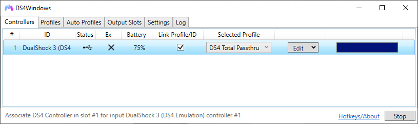{: .glightbox } 

        ??? summary "Extended description on how this profile is configured (click to expand)"

            This profile is based on the "Default" profile with some key differences:

            - Has set the Lightbar, Touchpad and Gyro Modes to "passthru"
            - Disabled/un-binded any Keyboard or Mouse related remapping
            - Disabed sticks "dead zone" and "anti dead zone"
            - Controller emulation is set to "DualShock 4"

    === "Part 2"

        1. Disable "Swipe Touchpad to Switch Profiles" on the Settings tab
            - Having this option enabled might cause DS4Windows to accidantly switch profiles when using the touchpad
        2. Check on your Auto Profiles tab if you haven't associated any Steam game to other profile that might disable the "DS4 Total Passthru" profile
            - In case you never messed with anything inside of the Auto Profiles tab then just ignore it 
        
        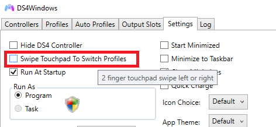{: .glightbox } 

    === "Part 3"

        1. Make sure [DS4Windows is running under a custom ".exe" name](../../guides/ds4w-custom-name/)
            - If DS4Windows is running under its default name of "DS4Windows.exe" then Steam will detect it and ignore every PlayStation controller in the system, making it impossible to use the virtual DS4 controller through Steam Input
            - Restart Steam after making sure DS4Windows is running under a custom ".exe" name
        1. Open Steam Settings -> controllers section
        1. Select the **General controller Settings** option
        1. Enable the "PlayStation Configuration Support" option
        1. Confirm that DS4Windows' virtual DS4 controller has been detected

        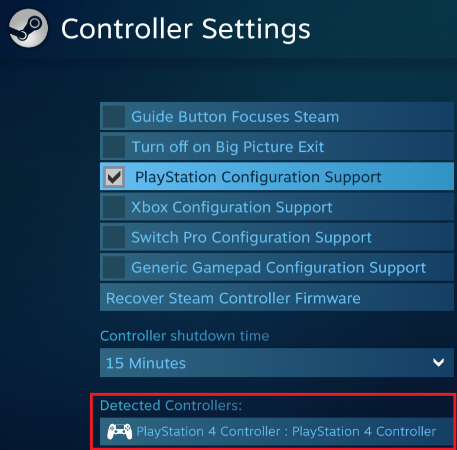{: .glightbox } 

    === "Final remarks"

        !!! important "Use Steam options to customize your controller"

            - After finishing the previous steps you should be able to safely use Steam to customize your controller
            - While using the "DS4 Total Passthru" profile it will be (mostly) like you were directly using your DS4/DualSense controller with Steam and without DS4Windows
            - Most customizations should be done via Steam settings. We won't instruct on how to do so since there are probably countless tutorials throughout the internet on this

        !!! question "What safe to customize/use on DS4Windows side?"

            - You can edit the "DS4 Total Passthru" profile to...
                - Tweak the "idle disconnect timeout" option in the "Other" tab
                - tweak the DS4 Bluetooth Polling Rate option in the "Other" tab
                    - It's set for 15min on the initial configuration
                - Set special actions that can be used to check Battery life or disconnect the controller on button combo
                    - Just remember the chosen button combo in order to not conflict with Steam
            - On DS4Windows settings you can...
                - Tweak the "Flash lightbar at high latency"
                - Enable the UDP server

??? caution "Disabling almost every DS4Windows functions (use real controller directly with Steam Input or other app without interference)" 

    === "Info"
    
        !!! info "For who this configuration might apply"

            For those who want to use only Steam Input or are using apps with native support to DS4 controllers, but need DS4Windows to:

            - Check the controller's battery life
            - Check the controller's input latency
            - Use DS4Windows to disconnect the controller through the "idle disconnect" option / Special action / right-clicking on the BT icon in the "controllers" tab
            - Set the controller's BT polling rate
                - (Some info left to confirm: which BT polling rate does Steam set the DS4 into? Can DS4Windows even change the controller's polling rate if Data Output to the controller is disabled?)

        !!! info "Purpose of this configuration"

            In this configuration, DS4Windows will try as best as it can to "do nothing" that could interfere with the communication between the controller and Steam/whatever other application:

            - No virtual controller will be spawned
                - The real controller should then remain visible as normal to applications
            - DS4Windows will not send data back to the controller
            - Settings that could auto-switch profiles or change settings on button combination/controller action will be disabled

    === "Part 1"

        If your real controller is hidden then you need to un-hide it (your controller needs to be in "X"/Shared Access Mode accordingly to the "Ex" column in the main "Controllers" tab)

        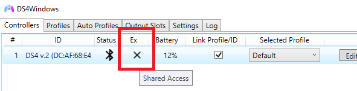{: .glightbox }

        If your controller is not in "X" (Shared Access) mode then:

        1. On DS4Windows' Settings tab make sure that the "Hide DS4 controllers" option is DISABLED
        2. In case you are using HidHide... you probably remember how you hid the controller, so you should know how to un-hide it as well (we have faith in your memory!)
            - In case you need help with HidHide: [HidHide usage troubleshoot](../../troubleshooting/hidhide-troubleshoot/)
            - It's recommended to reconnect your controller after unhiding it with HidHide

    === "Part 2"

        1. Verify on DS4Windows' Log tab which version you are using
        2. Download the following pre-made profile archive accordingly to your DS4Windows version:
            - For DS4Windows v3.0.18: [Do Nothing Mode](https://github.com/CircumSpector/DS4WDocs/files/7566751/Do.Nothing.Mode.-.DS4Windows.3.0.18.profile.zip)
        3. Extract the profile file (.xml) from inside the archive to a folder of your choice
        4. On DS4Windows' profile tab Import the extracted profile
        5. Select the "Do Nothing Mode" profile for your controller in the main "controllers" tab
        
        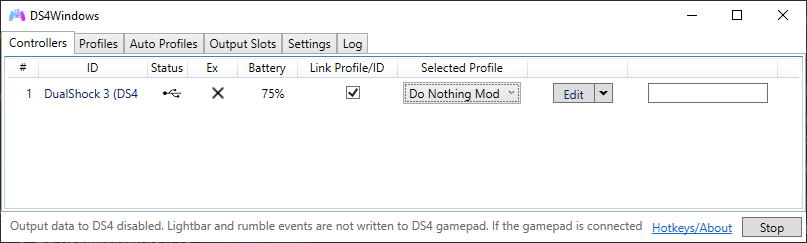{: .glightbox } 

        ??? summary "Extended description on how this profile is configured (click to expand)"

            This profile has...:

            - Disabled Virtual Controller creation
            - Disabled/un-binded every possible remapping function or setting that could affect controller usage
            - Has set the Lightbar, Touchpad and Gyro Modes to "passthru" in order to "disable" possible remapping functions
            - Disabled Output Data to the controller

    === "Part 3"

        1. Disable "Swipe Touchpad to Switch Profiles" on the Settings tab
            - Having this option enabled might cause DS4Windows to accidantly switch profiles when using the touchpad
        2. Check on your Auto Profiles tab if you haven't associated any Steam game to other profile that might disable the "DS4 Total Passthru" profile
            - In case you never messed with anything inside of the Auto Profiles tab then just ignore it 
        
        {: .glightbox } 

    === "Part 4"

        1. Make sure [DS4Windows is running under a custom ".exe" name](../../guides/ds4w-custom-name/)
            - If DS4Windows is running under its default name of "DS4Windows.exe" then Steam will ignore every PlayStation controller in the system, making it impossible to use the virtual DS4 controller through Steam Input
            - Restart Steam after making sure DS4Windows is running under a custom ".exe" name
        2. Open Steam Settings -> controllers section
        3. Select the **General controller Settings** option
        4. Enable the "PlaysStation/Nintendo Configuration Support" option accordingly to the type controller you are using
        5. Confirm that your controller has been detected
            - If Steam has not detected your controller, then either: 1) you are not running DS4Windows under a custom ".exe" name or haven't restarted Steam after changing the name, or 2) your controller is hidden either by Hidhide or by DS4Windows' "Hide DS4 controllers" option 

    === "Final Remarks"

        If everything has been set correctly, then:

        1. Your controller will be present on DS4Windows, but the later won't spawn virtual devices associated to it nor have any setting enabled that could prossibly interfere with other applications while the "Do Nothing Mode" profile is being used
        2. Your real controller is not being hidden from Steam and other apps and can detected as normal by them 

    === "Customization"

        !!! question "What is safe to customize/use on DS4Windows side?"

            - On the "Do Nothing Mode" profile, you can edit it to:
                - Tweak the "idle disconnect timeout" option in the "Other" tab
                - Tweak the DS4 Bluetooth Polling Rate option in the "Other" tab
                - Set special actions that can be used to disconnect the controller on button combo
                   - Just remember the chosen button combo in order to not conflict with Steam/other apps settings
            - On DS4Windows settings you can...
                - Enable the UDP server 
                - Set DS4Windows to start with Windows and tweak other DS4Windows specific settings

### Advanced

??? caution "Using DS4Windows only for non-Steam games, but keep DS4Windows running ("Started") at all times without interfering with Steam"         

    === "Warnings / Info"

        !!! important

            - This is a very specific configuration, only for those that DON'T want to use DS4Windows when playing Steam games, but also don't want to manually Stop/Start DS4Windows everytime they want to use their controller with Steam
                - Most users are better of just manually stopping DS4Windows if they don't want to use DS4Windows + Steam
            - This is basically the "Disabling almost every DS4Windows functions" guide on the section above, with a few variations

        !!! caution

            - This configuration can only work if the user is using HidHide for controller hiding
                - Though the user could manually use the "hide DS4 controllers" option, they would need to do so manually (with mouse and keyboard) and would defeat the purpose of this configuration
                - Though it's possible to use this configuration without both HidHide and the "hide ds4 controllers" option the user would most likely suffer from double-input issue in non-Steam games

        !!! info "Purpose of this configuration"

            - Keep real controller hidden by HidHide to prevent the double input issue, but allow Steam to have access to hidden real controllers so it can directly pick them
            - Switch effortlessly between a non-Steam-interfering profile and the usual DS4Windows' profiles used for non-Steam games 
            - Tweak DS4Windows configurations to prevent accidental profile switching mid-game

    === "Part 1"

        This guides assumes that...

        1. You are NOT using the "Hide DS4 controllers" option in DS4Windows settings
        1. You are using HidHide for controller hiding and that your real controller is already hidden by it
            - If you don't know what is HidHide or why it's necessary to hide real controllers when they are being used along DS4Windows then check the ["Preventing the double controller / double input issue in games" guide](../../guides/solving-double-input/)
       
        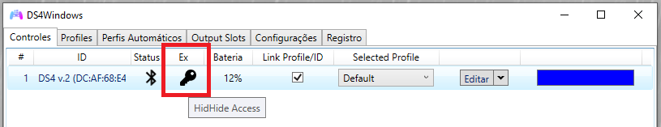{: .glightbox }
        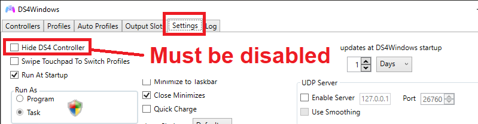{: .glightbox }

    === "Part 2"

        1. Add `steam.exe` to HidHide Configuration Client' "Applications" List
            - This is necessary for Steam to be able to detect hidden controllers
            - Steam install directory is usually at `C:\Program Files (x86)\Steam`
        1. Make sure DS4Windows is fully stopped AND closed
            - If DS4Windows is running at this point Steam will ignore PlayStation controllers in the system, real or virtual
        1. Close then Start Steam again
        1. Open Steam Settings -> controllers section, then select the **General controller Settings** option
        5. Confirm that your controller has been detected
            - If Steam has not detected your controller, then either:
                1. You didn't properly added Steam to HidHide's Applications list, or...
                1. DS4Windows is still running in the background, which makes Steam ignore PlayStation controllers in the system, real or virtual

        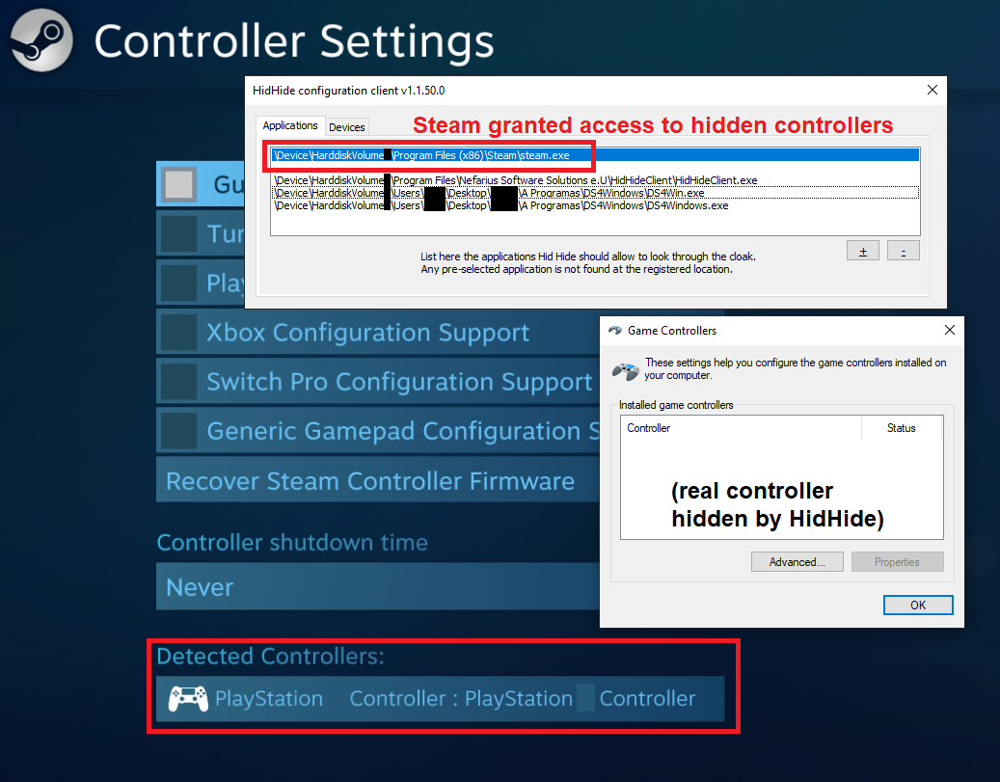{: .glightbox }

    === "Part 3"

        1. Follow the "Disabling almost every DS4Windows functions" guide on this page's previous sub-section EXCEPT for its "Part 1"
            - It's necessary to skip Part 1 since you need your controller to remain hidden by HidHide in order to prevent the double input issue in games not launched through Steam
        1. Continue here after you are done with the other guide

        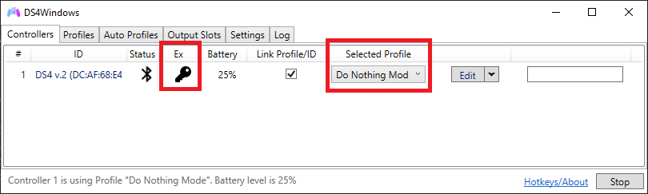{: .glightbox } 

    === "Part 4"

        If you followed everything correctly, then:

        1. Your real controller is still hidden by HidHide and Steam has access to hidden controllers
        1. You are running DS4Windows under a custom ".exe" name so Steam does not ignore PlayStation controllers
        1. You have imported the "Do Nothing Mode" profile into your DS4Windows
        1. You've tweaked some DS4Windows settings in order to prevent accidental profile switching

        From now on:
        
        - When using Steam you must load the "Do Nothing Mode" profile for your controller, which will disable DS4Windows' virtual controller as well as prevent other conflicts.
        - When playing games not launched through Steam you must switch to a "normal" DS4Windows profile with Xbox or DS4 emulation controller

    === "Final Remarks"

        !!! important "Switch between profiles by setting Special Actions"
            
            - Because the major point of this guide is not having to interact with DS4Windows with keyboard/mouse, it's better to set Special Actions in the "Do Nothing Mode" and other used profiles in order to switch between them via Button combo
                - Just make sure whatever buttom combo you set in the "Do Nothing Mode" profile does not conflict with other Steam configurations

        !!! caution "Beware of options that can cause accidental profile switch"

            - Be careful if you've set automatic profile changes in the "Auto Profiles" tab
            - Remember to keep the "Swipe Touchpad to Switch Profiles" option disabled on DS4Windows' "Settings" tab
                - Having this option enabled might cause profile switching when playing games that make use of the Touchpad

        !!! caution "Possible Steam conflicts"

            Steam keeps remapping detected controllers even outside of games depending on your Steam configurations, meaning it may attempt to do controller to keyboard/mouse remapping which might conflict with DS4Windows settings.
            
            As such, the the user needs to keep in mind both its Steam _and_ DS4Windows settings if they suffer from unintentional, random actions.  
        

## Related links

- [Steam related issues](../../troubleshooting/steam-related)
- [Preventing the double controller / double input issue in games](../../guides/solving-double-input/)
- [Running DS4Windows under a custom ".exe" name](../../guides/ds4w-custom-name/)
- [XInput slots order issues](../../troubleshooting/xinput-slots-order/)
         
