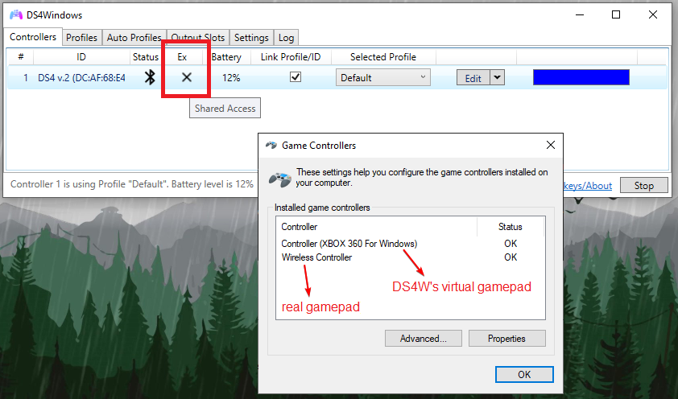
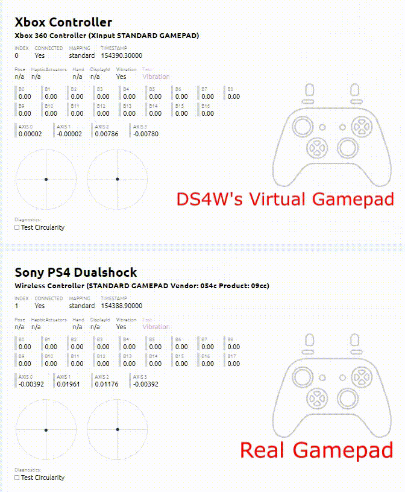
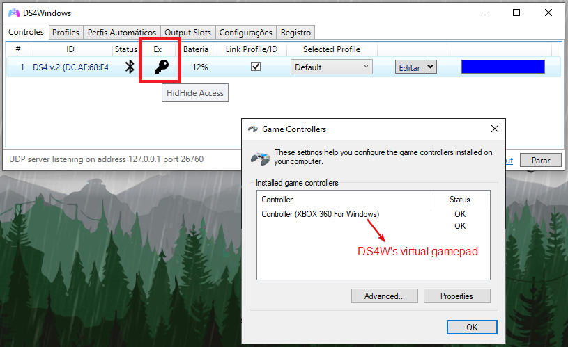
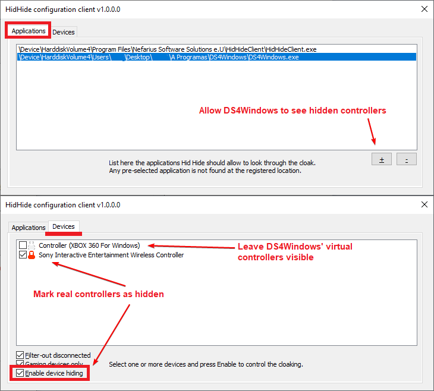
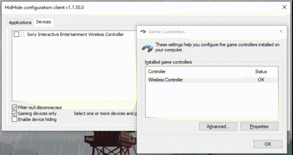
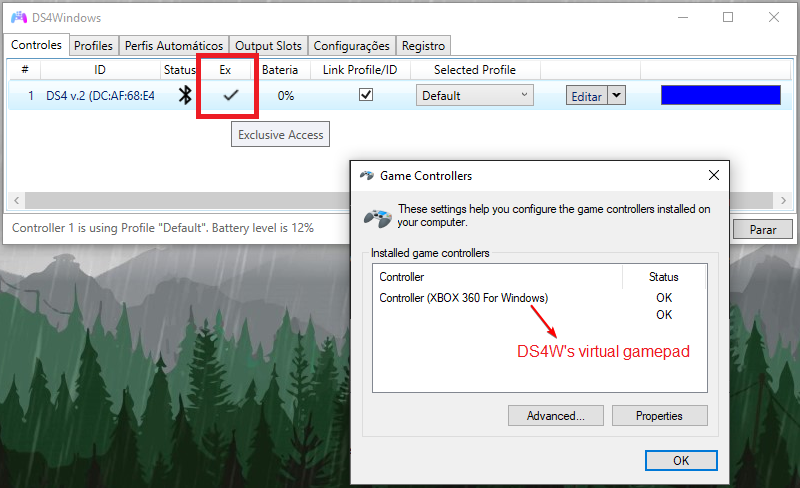

# Preventing the double controller / double input issue in games

## About the double input (controller) issue

DS4Windows does not magically transform your gamepad from one type to another. It creates a **_virtual_** gamepad that is associated to your real one. This means that if you have 1 real gamepad connected then windows will actually detect 2 gamepads (real + virtual). If 2 real then 4 and so on.

The image below shows how Windows behaves when a DS4v2 (Wireless Controller) is connected to the system while DS4Windows is emulating a Xbox gamepad:

{: .glightbox }

This situation can make games/apps receive commands from both the real gamepad as well as DS4Windows' virtual controller/keyboard at the same time, which can lead to lots of different issues. Check the examples below:

??? info "GIF showcasing the double input issue (click to expand)"

	!!! important 
		- "Keep in mind that the "double input issue" encompass every problem related to 2 controllers responding to the same user' input, even if both controllers are not 100% mimicking each other
		- Test it yourself on the [Gamepad Tester Website](https://gamepad-tester.com/)

	{: .glightbox }

??? info "Problems caused by the double input issue (click to expand)"

	The game may:

	- Detect every command twice, making it unplayable
	- Start 2 player mode randomly
	- Ignore the virtual controller because it picked the real controller first
	- Respond incorrectly to the controller's inputs
		- Usually happens because, even though the game is correctly reading the virtual controller, it is also incorrectly reading the real controller's inputs at the same time
	- Do not respond to any controller command
		- Usually happens because the game detected the real controller first while being simultaneously unable to read its inputs
	- Other non-obvious issues

---------------------

__To prevent or fix this issue it's necessary to hide the real controller in order to make only DS4Windows' virtual controller/keyboard visible to games.__ This can be done in two ways:

- HidHide (recommended)
- DS4Windows' `Hide DS4 Controllers` option (legacy, non-recommended option)

## Methods to prevent it

### HidHide (recommended)

HidHide is a driver that allows the user to selectively hide gamepads in the system and only allow some of them to still detect them even while they are "invisible".

It is the recommended method because once it has been properly setup the double input issue is solved for good for the hidden controller.

In DS4Windows case, the user needs to set HidHide to:

1. Hide the **REAL** controllers in the system __once when connected via USB and once when via Bluetooth__
1. Allow DS4Windows to see all hidden devices, otherwise it would think there are no supported gamepads connected

=== "HidHide result"

	
	{: .glightbox } 

=== "HidHide Configuration Client"

	{: .glightbox }

=== "Example: Hiding a DS4"

	{: .glightbox } 

HidHide has its own [dedicated setup page](https://vigem.org/projects/HidHide/Simple-Setup-Guide/). Users who know more or less what they are doing can follow the quick setup section and for the ones having trouble there is also the step-by-step section.

#### HidHide Usage tips

!!! info "General usage tips"

	- After installing the HidHide driver you **MUST** reboot your system before using it
	- If HidHide is properly configured then the `Hide DS4 controllers` option under DS4Windows' `Settings` tab is redundant and should be left disabled
	- Though HidHide's own setup guide should cover everything the user needs, this site also has a [dedicated HidHide usage troubleshooting page](../../troubleshooting/hidhide-troubleshoot/) for users having trouble configuring it or confirming if their real controllers are actually hidden.

!!! important "HidHide Configuration Client tips"

	- In order to avoid confusion, make sure DS4Windows is stopped or fully closed __BEFORE__ opening HidHide's Client so only real controllers appear on its devices list
	- DO NOT HIDE Controllers with the name "Sony **COMPUTER** (...)", as they are virtual DS4 controllers
	- Remember to close HidHide's Client before re-opening DS4Windows, otherwise the `Ex` check will fail even if the controller is correctly hidden

### `Hide DS4 Controllers` option (legacy. Not recommended)

!!! warning "Note to users of HidHide"
	If you have HidHide installed and correctly setup then this option is redudant and should be left disabled to prevent issues or confusion.

!!! important "Though it is written "DS4 Controllers" it applies to any real controller detected by DS4Windows"

??? abstract "About the legacy "Hide DS4 controllers" option (click to expand)"

	This option exists on DS4Windows' `Settings` tab. When enabled, DS4Windows will _kindly_ ask Windows for exclusive access to detected devices, meaning the later would only allow DS4Windows to detect the gamepads and preventing the double input issue.

	{: .glightbox } 

	The problem with this method is that Windows can deny the exclusive access request when another process already has a open connection to the gamepad. Common reasons for this request to fail are:

	- A game already is running
	- Google chrome/Opera is running (why does it have a connection to the gamepad you ask? A mystery)
	- Nvidia Geforce experience process having a hold of the gamepad
	- Random non-obvious process having a hold of the gamepad
	- etc

	Even if it works initially, if your gamepad disconnects in the middle of a game chances are that you'll lose exclusive access upon reconnection, requiring you to close the game to try again.

	For the reasons explained above, the `Hide DS4 Controllers` option is **NOT RECOMMENDED**, though it remains available to users that need to use it for whatever reason. HidHide is the better option all around for those who can use it.

	!!! note "Dedicated troubleshooting page"
		In case you really need to use this option, there is a [dedicated troubleshooting page for the `Hide DS4 controllers` option](../../troubleshooting/hide-ds4-option/) that can be followed to verify why windows is failing to grant the exclusive access request.

## Related links

- [Examples of games that suffer from the double input issue](../../under-construction)
- [HidHide usage troubleshoot](../../troubleshooting/hidhide-troubleshoot/)
- [_"Could not open (controller) exclusively" / Hide DS4 controllers option not working_ troubleshoot](../../troubleshooting/hide-ds4-option/)
- [Troubleshooting gamepad detection issues](../../troubleshooting/ds4w-controller-detection/)

