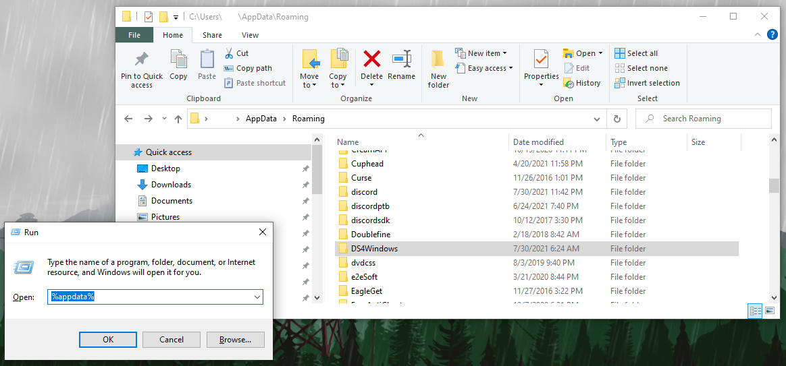
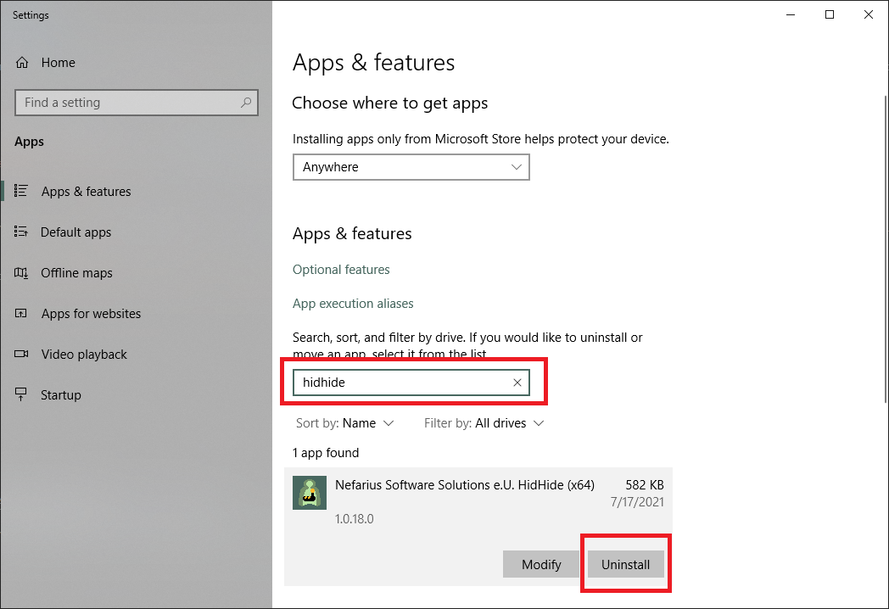
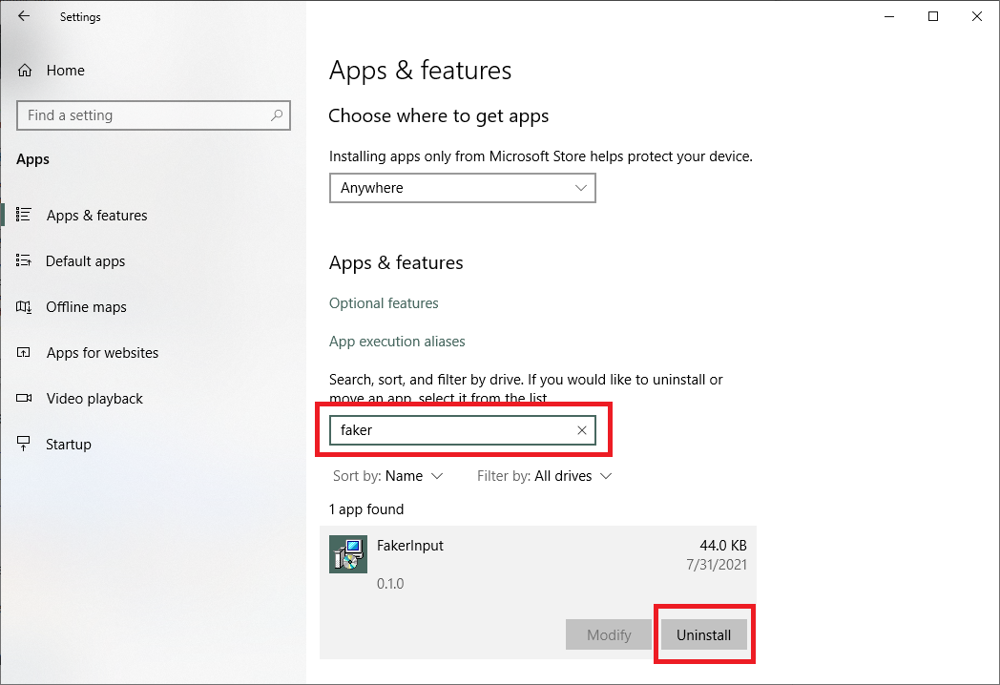

# Uninstalling DS4Windows and related drivers

## DS4Windows

!!! important "Want a back up?"
    If the plan is to reinstall DS4Windows later you might want to do a [backup of your user data](../managing-user-data) first

### Main program

DS4Windows is a portable application, meaning it is not actually "installed". To get rid of DS4Windows just delete its folder. Simple as that.

### Settings and user data

- Press ++win+r++, type `%appdata%` and then select OK. This should open windows `appdata/Roaming/` folder
- Verify if the DS4Windows folder exists there and delete it if found

{: .glightbox }  

## Related drivers

These are companion drivers that are currently used by DS4Windows. If you are looking for more info on what they are and their purpose, check the [_about companion drivers_ page](../../about-ds4windows/companion-drivers/).

??? info "ViGEmBus (click to expand)"
    !!! important 
        Keep in mind that the Nefarius' ViGEmBus is used by a good number of [other applications](https://github.com/ViGEm/ViGEmBus#known-users-of-vigem), with the most known one being Parsec. If you have other programs that make use of the ViGEmBUS, then uninstalling it may break their functionality, though the program might just prompt you to install it again
    - Check [ViGEmBus's removal section](https://vigem.org/projects/ViGEm/How-to-Install/#removal) on the original ViGEmBus' documentation

??? info "HidHide"
    - Open Windows' `Apps & Features` (search for it on the start menu)
    - Search for/locate "HidHide"
    - Uninstall it and then reboot your PC
    {: .glightbox } 

??? info "FakerInput"
    - Open Windows' `Apps & Features` (search for it on the start menu)
    - Search for/locate "FakerInput" and uninstall it
    {: .glightbox } 

## Legacy drivers

These are drivers that are not used anymore but users might still have installed if they've been using DS4Windows for a long time

??? info "HidGuardian"
    - Follow  [HidGuardian's section on HidHide's guide](https://kanuan.github.io/DS4WSite/troubleshooting/ds4w-controller-detection/) to verify if HidGuardian is present and how to uninstall it

??? info "Uninstalling ScpVBus"
    !!! note "To Do: include pictures"
    - Locate the `Virtual Gamepad Emulation Bus` on device manager (do not confuse it with the `Nefarius' Virtual Gamepad Emulation Bus`)
    - Uninstall it while also ticking the `Delete the driver for this device` checkbox
    - Check with `Driver Store Explorer` if it's still present on the system and remove it if true