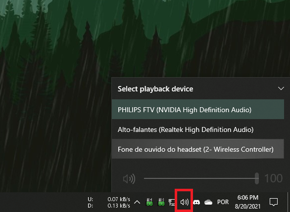
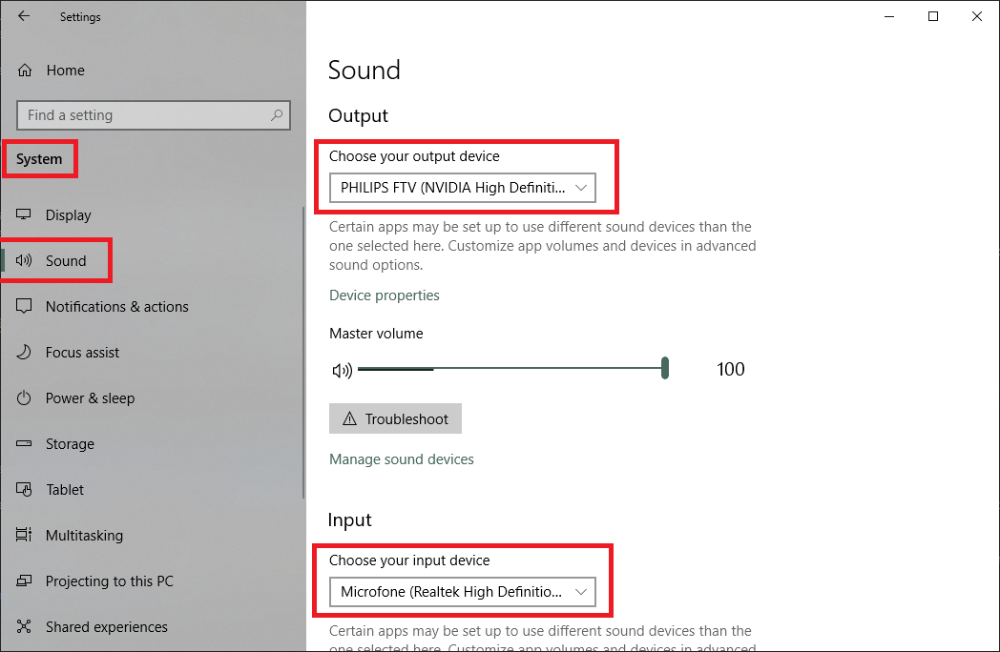
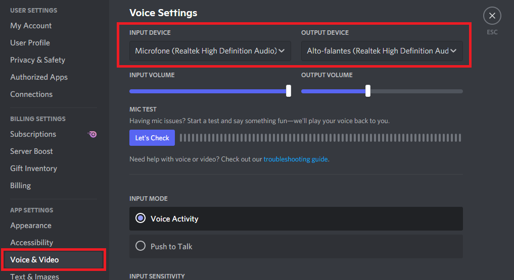
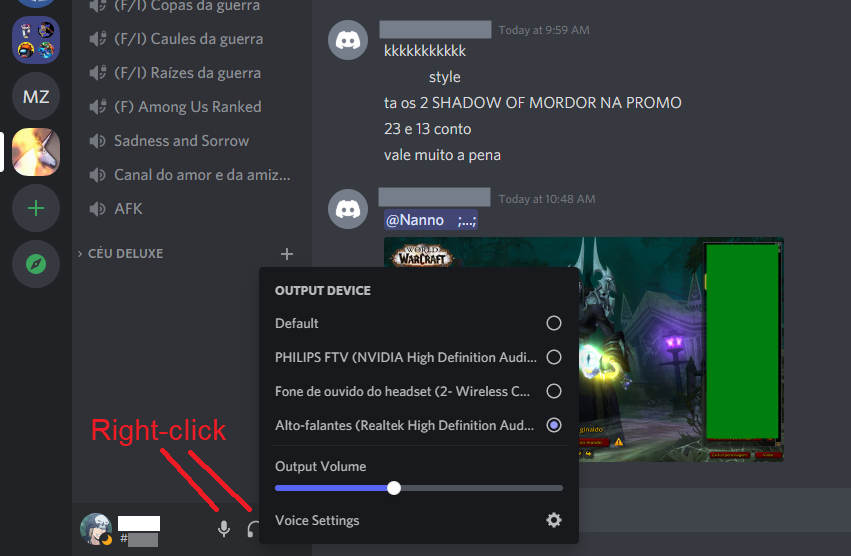

# Headphone or mic related issues when using supported gamepads

## General info

Some official and third-party DualShock 4 and DualSense gamepads support audio input/output when connected to the PC __via specific connection methods__ (mostly USB only). This page is dedicated on instructing users on how to fix some "issues" that might happen when connecting their gamepads to the PC and leave some comments

## List of gamepads that support audio input/output on PC

- DualShock 4 (version 2 only) connected via USB
- DualShock 4 connected via [Sony's USB wireless adapter](../../guides/connecting-controllers/#sony-dualshock-4-usb-wireless-adapter)
- DualSense connected via USB
- Possibly DualShock 4 copy-cats via USB (rare situation, most don't have any working audio functions when used on PC)

## Switching between audio devices on Windows and applications

!!! info "Switching audio devices in common system and apps settings"

	!!! important

		- If you are on Windows 11 some images may differ from your experience, but similar options should be found in similar places
		- It's impossible to cover all apps here, so use your common sense and try to find the audio settings on the app you are using yourself
		- Some apps don't have their specific audio settings and use what is defined on Windows' audio settings
			- Upon changing Windows' audio settings the app may need to be restarted

	=== "Windows Taskbar (headphone/speakers only)"

		{: .glightbox }

	=== "Windows Settings"

		{: .glightbox }

	=== "Discord..."

		=== "Settings"

			{: .glightbox }

		=== "Quick switch"

			- Right click on the headphone or mic icons:

			{: .glightbox }

## Common issues

### PC's own headphone/speaker or mic stop working when connecting a DualShock 4 or DualSense to the PC

Because some gamepads expose their headphone and mic jack when connected (check the list above on this page) Windows may be auto-switching to them as the new computer's default.

The "fix" is instructing Windows or the application being used (Discord, Skype, some games that support audio communication) to switch back specifically to the desired headphone/mic. Have a look at the "switching between audio devices" section on this page.

### Headphone or headset doesn't work when connected via the gamepad

Things to check:

1. Do you have a controller that has audio support when connected to the PC according to the list on this page? Is it connected by one of the supported methods also described on the list?
	- Remember, currently no official gamepad exposed its audio functions when connected through Windows' Bluetooth
1. Have you selected the gamepad's headphone or mic as the desired audio devices accordingly to the "_Switching between audio devices_" section?

If everything looks _OK_ but the headphone/mic still isn't working then... Don't know, sorry. Maybe the headphone jack port is broken or you are suffering from some poor contact?

## Frequently Asked Questions

### "Can I use my DS4/DualSense's headphone jack when connected via the standard Windows Bluetooth?"

No, this feature is not implemented. Is it possible to implement this? Apparently yes. ___WILL___ it be implemented? The answer is probably ___no___ unless some new developer steps in to specifically focus on this.

What most users don't understand is that:

- DS4Windows is a free, open-source software developed by a few people out of their own limited free time. Have you ever had to work, study, have fun _and still have time left to work on non-paid software for random internet users?_ Balancing all these things is not an easy task
- Even minor things can be complicated to be implemented. Audio input/output over Bluetooth is complicated, specifically because there is a LOT that is not known for the lack of documentation, so sometimes it takes way too many hours of work just to __test__ something
- There are other more important things to focus that actually impact gaming. if users need wireless headsets they can just buy a dedicated one. As such, this niche feature is really low on the _To Do_ list