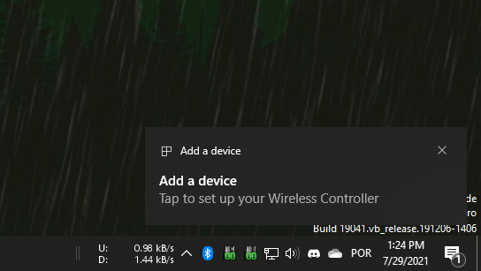

# Bluetooth connection issues

!!! important "PAGE PURPOSE"
    - This page is dedicated for issues regarding connecting, reconnecting or maintaining Bluetooth connection with the controller
    - If your controller connects and stays connected as normal but is not detected by DS4Windows then refer to the [_controller detection issues_ page](../controller-detection/)

## Most common solutions (check this first)

### Using a good quality, dedicated USB BT Adapter

- Integrated BT adapters are usually bad
- Most problems are caused by a [bad bluetooth connection](../input-delay-bt/#causes-of-high-or-unstable-latency)
- Though most controllers will work with a 2.1 BT adapter, more modern ones usually have better signal quality
    - A (at least) 4.0 BT adapter is recommended 

### Re-pairing it to Windows using the correct method

There are 2 ways a controller can be paired to Windows:

- The controller makes the connection request to Windows (incorrect method)
- Controller is set in its special `pairing mode` and then the user manually makes Windows connect to it (correct method)

If the controller has been connected in the wrong method it will 100% not work even though it _appears_ on Windows as if it has been properly added. If in doubt, make Windows remove the controller from its Device list and re-pair it again using the correct method. Check the following section on how to propperly connect a controller to the PC.

!!! important "Pairing a controller to Windows"
    === "Correct method"

        {: .glightbox } 

    === "Incorrect method"

        {: .glightbox } 

## How to properly...

### Pair a controller to Windows

1. Verify if the controller is not already on Windows' Paired Devices list. If it is, remove it as per the next section
1. Follow the instructions in the dedicated [_Connecting your controllers to the PC_ page](../../guides/connecting-controllers/#bluetooth)

### Remove a paired controller from Windows

!!! info
    === "Usual way (Settings)"

        - Open Windows' Bluetooth Devices list on its Settings
        - Locate your controller on the list, click on it then select `Remove device`

        {: .glightbox } 

    === "Alternative way (Devices and Printers)"

        Sometimes this can be used when Windows' fail to remove a device through the usual Devices Settings menu

        - Open Windows' [Devices and Printers](../controllers-check/#windows-devices-and-printers)
        - Locate your device, right-click it then select `Remove device`

        {: .glightbox } 

## Windows can't find the controller when trying to add it in `Bluetooth & Other Devices`

- [__MAKE SURE YOUR DEVICE IS IN PAIRING MODE!__](../../guides/connecting-controllers/#bluetooth)
- For most controllers a 2.1 Bluetooth adapter is required
- __Windows will not detect the device if it already is on its paired devices list, requiruing it to be removed from there beforehand__
- If the controller has been previously connected to the PC but does not appear on the list anymore, check if it still exists on Windows' [Devices and Printers](../controllers-check/#windows-devices-and-printers)
- Sometimes Windows takes an awful long time to detect DS4v1 controllers

## Controller connects and stays connected but Windows / DS4Windows does not recognize it

- Re-pair the controller to Windows using the correct method explained in one of the topics above just to be sure
- If you're using a controller from your gaming console (PS3, PS4, PS5, Switch) make sure it has not accidentally connected to it/turned it on. It is recommended to fully turn off/unplug it when first attempting to pair the controller to the PC
- If this is not the case, check the dedicated [_controller detection issues_ page](../controller-detection/)

## Controller always needs to be fully removed and re-paired to connect / Controller does not reconnect after system reboot, sleep or shutdown cycle

### General info

- If using a USB BT adapter it may be a compatibility issue between the adapter and the USB port being used. Test the adapter in other USB ports (un-pair the controller before moving the adapter)
    - Sometimes this issue is caused by BT adapters that were were made for 2.0 USB ports being used in 3.0 ones
- It's possible that your BT adapter model is just not fully compatible. Test with a different adapter
- Possible issues with BT adapter driver. Even if your BT adapter appears to work, check if there isn't a specific manufacter's driver that is required for it to properly function

###  For users of BthPS3 + DsHidMini / Shibari

Refer to [BthPS3's documentation]() for proper understanding on BthPS3 behavior with DS4/DualSense controllers.

!!! important "Too Long, Didn't Read:"
	- If you don't use DS3 controllers in your PC then you probably don't have the BthPS3 driver
    - Usualy, there is no actual issue besides the user having to turn on DS4/DualSense controllers 2 or 3 times before it actually manages to reconnect

## High input delay issues / latency spikes

Check the dedicated [_Input delay on Bluetooth_ page](../input-delay-bt/) for more info on this.

## Controller connects and can be used as usual with DS4Windows, but sometimes randomly disconnects or stop responding

!!! important
    If you are seeing the `Add a device` notification when trying to reconnect your controller then it is actually not properly paired. Check the "How to properly pair the controller" section on this page

- Generally causes by a bad Bluetooth signal stability. Refer to the [_Input delay on Bluetooth_ page](../input-delay-bt/#causes-of-high-or-unstable-latency) for more related info
- Possible faulty controller or dying controller battery
- Check DS4Windows' log for error messages
- Verify if the issue does not occur when DS4Windows or Steam are not running
    - Keep in mind that using some controllers (DS4, DualSense) with DS4W or Steam makes them transfer more data, thus making them more prone to lose connection if your BT adapter is not up to the task 

## Cannot connect more than 1 controller / Connection loss when multiple controllers are used

- Caused by a bad quality BT adapter or high signal interference
- BT adapter can't mantain the necessary data rate
- Refer to the [_Input delay on Bluetooth_ page](../input-delay-bt/#causes-of-high-or-unstable-latency) for more related info

## Windows using integrated BT adapter instead of the external/USB adapter

!!! note "To Do"
    Add pictures and improve general text description

The integrated BT adapter must be disable on Windows' Device Manager:

- Press ++win+x++ on the keyboard and select `Device Manager` on the appearing selection window
- Locate the integrated BT adapter under the Bluetooth section and disable it
- Replug the dedicated adapter or try disabling and enabling it again  

## Loss of WiFi signal if controller is connected via BT or Loss of BT connection when WiFi is being used

- If using an integrated card that double as both the Bluetooth and Wifi adapter then it's possible that its signal quality is so bad that one is interfering with the other. The solution would be to use a dedicated, good quality USB BT adapter
- Even if using independent BT and Wifi Adapters, if the signal quality of one of them is bad then it's quite easy for severely interferece between them to occur anyway
- Make sure other devices' (laptops, smart TVs, smartphones) WiFi and Bluetooth signals are not generating radio interference near the PC
- When DS4Windows starts communicating with controllers the amount the data being traded vastly increases and may serve as an explanation if this issue does not occur when the controller is connected but DS4Windows is not running
- Refer to the [_Input delay on Bluetooth_ page](../input-delay-bt/#causes-of-high-or-unstable-latency) for more related info

## Controller sometimes tries to reconnect to wrong, nearby PC

Both PCs' Bluetooth adapters probably have the exact same MAC Address, so the controller can't differentiate between them and tries to connect to the first one that responds.

Check the dedicated [_Controller trying to reconnect to wrong, nearby PC_ page](../../other/under-construction) for more info on how to verify if this is the case and how to fix the issue.

??? info "Move content to dedicated page in the "other" section"

    When trying to reconnect, a controller tries to locate the BT adapter with the same MAC Address of the last PC it has been paired to.

    The only way for a controller to try reconnecting to the wrong PC is if both PC's Bluetooth adapters have the exact same MAC Address, a situation that can easily happen if the user has brought multiple adapters from the same model.

    The fix to this is to either:

    - Replace one of the PCs' BT adapter with one that has a different MAC Address or...
    - Use a tool to rewrite the BT dongles MAC Address __out of your own resonsability__
        - Even though many users had success with this tool there is always a small chance that things can go wrong and BT dongle ends-up dead. As such, we recommend using only with USB BT Adapters since these can be easily replaced
        - If you understood the points above, the tool is 

