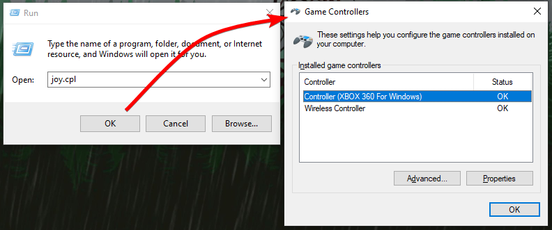

# Ways to check if a controller has been detected by Windows

!!! important "Keep in mind!"
	- If you want to troubleshoot issues with your __real__ controller then it's better if DS4Windows is __stopped/not running__ for these checks, otherwise you might mistaken a virtual controller with the real one 
    - If the `Hide DS4 controllers` option is active or if you have controllers hidden with HidHide then they may not appear on the `Gamepad Tester` website or in Windows' `Game Controllers` list
    - Connected DS3 controllers used with DsHidMini in `DS4Windows mode` won't appear on the `Gamepad Tester` website nor in Windows' `Game Controllers` list. Confirm if they are detected on `DsHidMini Control Utility (DSHMC.exe)`

## Gamepad Tester website

The [Gamepad Tester](https://gamepad-tester.com/) should work in most modern browsers and will show detected controllers along with some additional info such as their vendor and hardware identification (VID/PID).

{: .glightbox }  

## Windows' Game Controllers list (joy.cpl)

Connected controllers should appear on Windows Game controllers list, also called `joy.cpl`. To open it:

- Press ++win+r++ in your keyboard, type `joy.cpl` then select `Ok`. Alternatively, you can...
- Use the search function on Windows' taskbar to find and open `Game Controllers`

{: .glightbox }  

## Windows' Devices and Printers

Windows' Devices and Printers should offer a simple view of connected devices. You can use it to confirm a device has been detected by:

- USB: verifying if there are changes when (dis)connecting a controller
- Bluetooth: checking if the controller related entry is present and its status

To open the Devices and Printers menu:

- Press ++win+r++ in your keyboard, type `control printers` then select `Ok`. Alternatively, you can...
- Open it from Windows' legacy `Control Panel`

{: .glightbox }  

## Windows' Bluetooth & Other Devices

This menu will show connected/paired Bluetooth controllers and other devicews, though it does not go much beyond that. Paired controllers can be removed here. 

To reach it, open Windows' `Settings` on the Start Menu and select it there.

{: .glightbox }  

## Windows' Device Manager

The Device Manager is the one source of truth to everything that makes part of your PC. If it has been detected then it will appear there, but because it is very techinical on how it presents devices to the users it may be a little hard for the average user to find their way around it. Regardless, to open it:

- Press ++win+x++ in your keyboard (or right click the Start Menu) then select `Device Manager`in the appearing menu

{: .glightbox }  