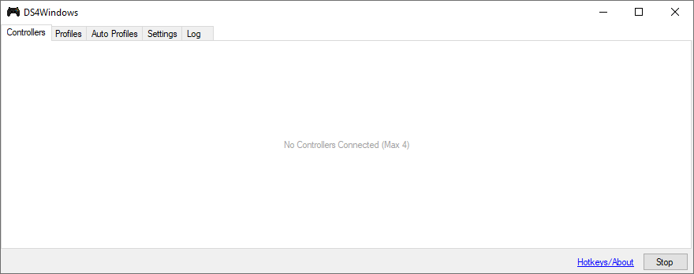
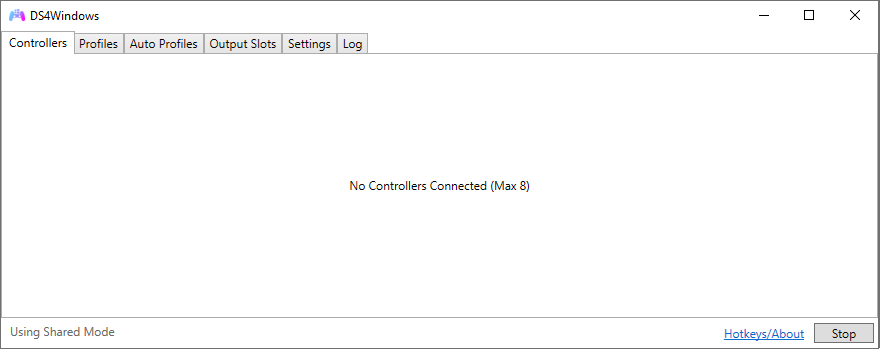
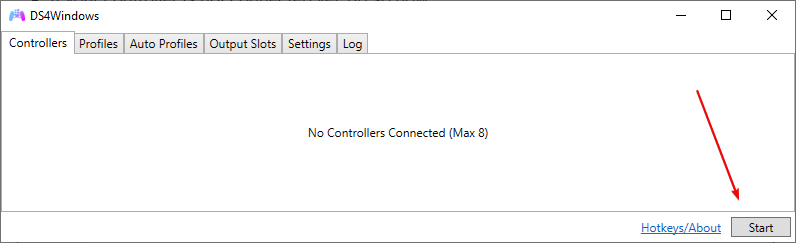
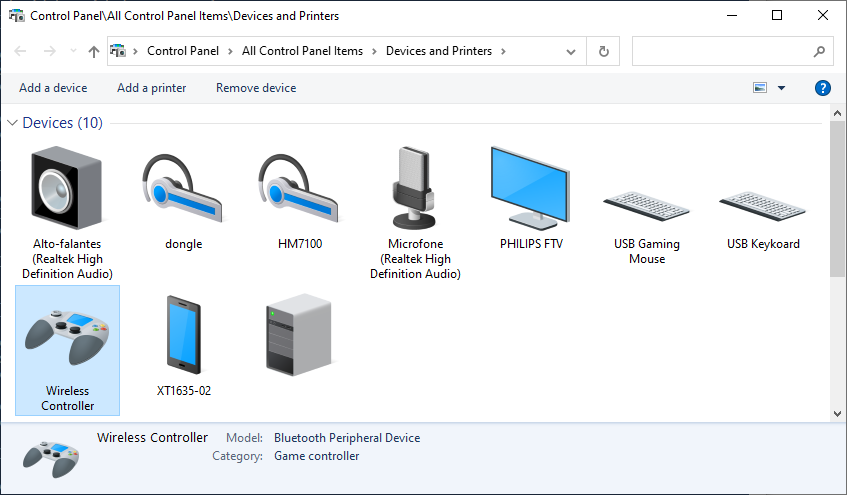
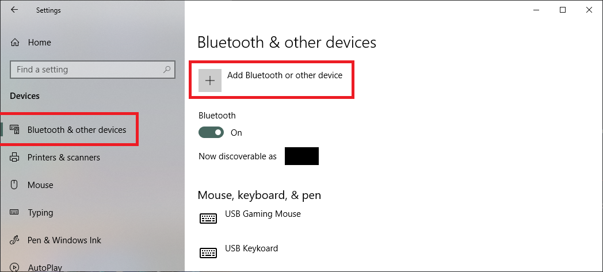
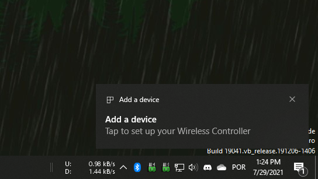
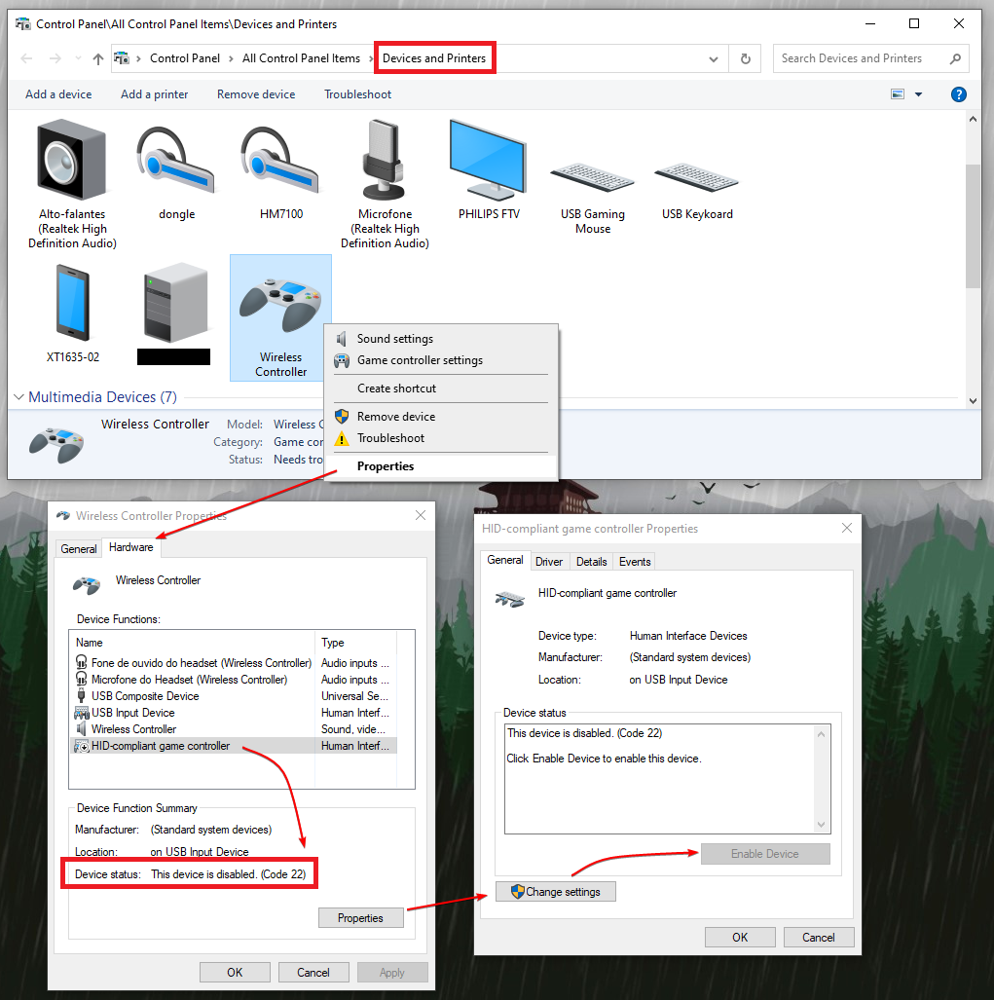
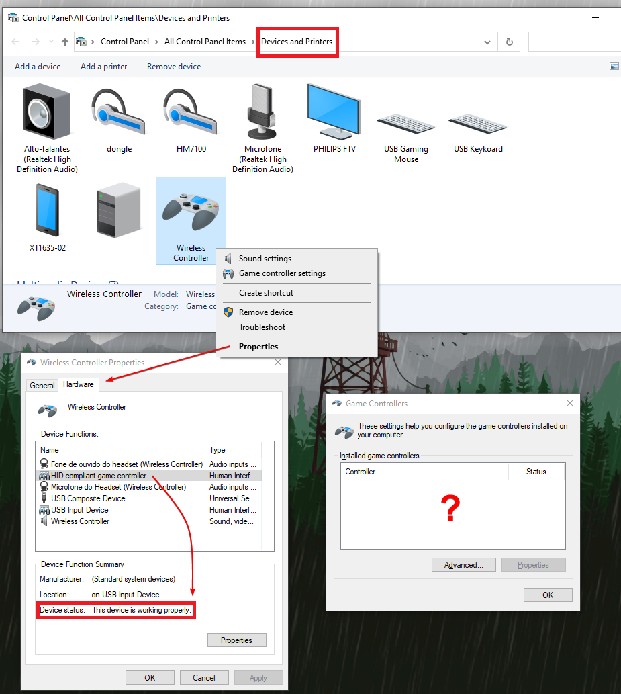
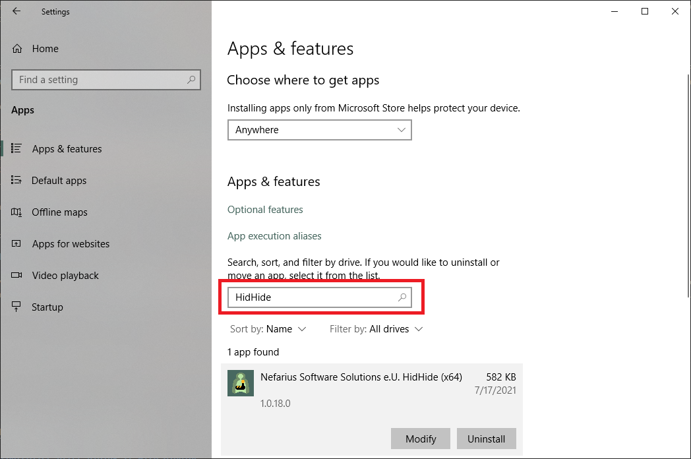
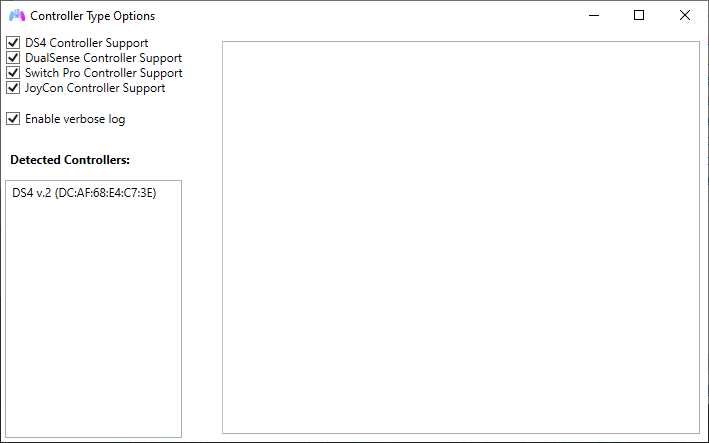

# DS4Windows not detecting controllers

!!! important "Know your way around Windows!"
    If you don't know how to reach Windows' Game controllers' list (joy.cpl), Device Manager, Devices & Printers, "Bluetooth & Other Devices" settings etc. then have a look at [this page](../controllers-check/)

## General information

This page is focused on troubleshooting issues that can make DS4Windows not detect your __REAL__ controller. If you are having trouble with games recognizing your gamepad then it's actually related to detection problems with the [virtual controllers DS4Windows creates](../../other/under-construction/).

## Situations that can make the controller undetectable by DS4Windows or Windows

### You are using obsolete or old versions of DS4Windows

If you just search "DS4Windows" on google, chances are that the first result is the obsolete version from jays2kings, which has not been updated since 2016 and should not be used anymore.

The currently maintained version you should be using is [Ryochan7's DS4Windows](https://github.com/Jays2Kings/DS4Windows/releases). If in trouble, check out the [installation guide](../../install-setup).

!!! info

    === "Obsolete"

        - Jays2Kings' DS4Windows v1.4.52
        - This version has not been updated since 2016 and should definitely not be used anymore
        - Note the black DS4 icon, that there is not `Output Slots` tab and the max number of controllers being 4

        {: .glightbox } 

    === "The version you should actually be using"

        - Ryochan7' DS4Windows v3.X.X
        - It's the currently maintained version 
        - Note the blue and pink DS4 icon, the presence of the `Output Slots` tab and the maximum number of controllers being 8

        {: .glightbox }  

### DS4Windows is stopped

Well, it needs to __actually be running__ for things to work, don't you agree? If it is stopped then you can press the `Start` button on the bottom-right to make things roll again.

{: .glightbox }  

### Controller is not properly connected / does not appear on Windows' Devices and Printers

You have connected your controller to the PC but it does not appear on Windows' Devices and Printers? What? How? No, that should not be possible under normal circunstances. Your controller MUST appear there in some shape or form, even if it does not looks like a controller.

!!! info "When connected via..."

    === "USB"

        When connected via USB a new entry should appear, so keep an eye for it. Test on other USB ports to be sure. If literally nothing happens then maybe:

        - You have a faulty cable
        - Your cable can only be used for charging and does not support data transfer
        - Your controller's or PC port is broken

    === "Bluetooth"

        When a controller has been paired to Windows via Bluetooth then its entry will exist there regardless if the controller is currently connected or not. Also...

        - There is a correct and a incorrect method of pairing a controller to Windows. Both will result in the controller appearing to be connected, but on the wrong way the controller won't remain connected for more than a few seconds and a `Add a device` notification will keep on appearing 
        - Check the dedicated [_Bluetooth connection issues_ page](../bt-connection-issues/) for more info

{: .glightbox }  

### Controller was connected to the PC via Bluetooth but was paired using the wrong method or needs to be re-paired

There is a correct and a incorrect method of pairing a controller to the PC via Bluetooth. Both will result in the controller appearing to be connected, but on the incorrect method the controller won't remain connected for more than a few seconds and Windows will sometimes show a `Add a device` notification.

Sometimes this happen when a user had previously connected the controller to the PC, removed the device and is trying to simply turn on the controller in the hopes that it will reconnect. [If in doubt, fully remove the controller from Windows' Device list and re-pair it via the proper way](../../bt-connection-issues/#pair-a-controller-to-windows). 

!!! important "Pairing a controller to Windows"
    === "Correct method"

        User manually makes Windows look out for a device that is in `pairing mode`

        {: .glightbox } 

    === "Incorrect method"

        User simply turns on the controller and tries to accept the `Add a device` notification

        {: .glightbox } 

### Controller has been accidentally disabled

!!! info "Happens mostly to users of the `Hide DS4 controllers` option"
    Although this problem mainly affected older versions of DS4Windows (text written after version 1.5.15) for various reasons, other mapping programs can cause the same problem to occur

There is a chance that DS4W has permanently disabled your controller in a previous attempt of gaining Exclusive Access when using the `Hide DS4 controllers` option. 

Though this can happen via any connection method, on Bluetooth removing and re-pairing the controller will fix the issue.

On USB, the easiest way to verify this is by checking if the controller works properly in other USB ports, though another indication for DS4 or DualSense users is that the lightbar will keep flashing yellow, indicating that the controller is only at a charging state (likewise, it will flash yellow only once then turn off if fully charged).

To check if your controller is disabled:

- Open Windows' `Devices and Printers` by pressing ++win+r++ in your keyboard, typing `control printers` then selecting `Ok`
- Locate your controller on the list
- Right-click on it, select `Properties` then select the `Hardware` tab
- Select the `HID-compliant game controller` and check its status at the bottom of the Window
- If disabled, re-enable it by clicking at `Properties` then `Enable device`

If it was disabled then re-enabling should fix the issue.

{: .glightbox }  

### Controller is enabled but hidden

{: .glightbox }  

If you found out that:

1. Your controller is properly connected
1. Your controller is __NOT disabled__ in the previous sections
1. Still does not appear on Windows' `Game Controllers` list
1. And is not detected by DS4Windows

Then it may be hidden. The following tools could be the culprit:

#### HidGuardian

HidGuardian is a driver that can prevent Windows from recognizing a connected controller as an actual game controller. It was used by DS4Windows to prevent the __double-input issue__, but support for it was removed in v3.0.8 for 2 reasons:

- Users didn't know how to properly configure HidGuardian and ended up having issues that were complicated to troubleshoot and fix
- The release of HidGuardian's successor, HidHide, which works the same but is more user-friendly

As such, the latest versions of DS4Windows won't request HidGuardian for hidden controller's access and if a controller is hidden by it then it won't be detected anymore. 

Users who still have HidGuardian installed must:

1. Uninstall it for their controller to be detected again
    - To verify if HidGuardian is installed and uninstall it if present, check the [legacy drivers section of DS4Windows uninstallation guide](../../guides/uninstalling-ds4windows/#legacy-drivers)
1. Install HidHide as a replacement for the "controller hiding" function that is necessary to prevent the double input issue 
    - For more information about HidHide and the double input issue, check the [_Preventing the double controller / double input issue in games_ guide](../../guides/solving-double-input/)

#### HidHide

HidHide is an optional (but highly recommended) third-party driver that can hide controllers from the system and only allow chosen processes to detect them. Its use along DS4Windows is recommended in order to prevent the [infamous double input issue](../../guides/solving-double-input). 

You can check if you have HidHide installed by opening Windows' `Apps and Features` and searching for it, though if it do is installed then it's probably just not properly configured to grant DS4Windows access to hidden controllers. Check [HidHide's guide]((https://vigem.org/projects/HidHide/Simple-Setup-Guide/#allowing-chosen-applications-to-see-hidden-devices)) for more info on that.

{: .glightbox }  

- If you are definitely sure DS4W has been properly whitelisted by HidHide and it still can't detect the hidden devices try temporarily disabling it by opening the `HidHide Configuration Client` and unticking the `Enable device hiding` checkbox in the `Devices` tab
- If it still doesn't work then try uninstalling HidHide via Windows' `Settings -> Apps and Features` __and rebooting__
- If even with HidHide uninstalled your controller does not appear on Windows' `Game Controllers` list then the problem lies elsewhere

### Controller is a copy-cat/replica

For these type of controllers to be detected by DS4Windows, they need to:

- or present themselves as a complete copy of the original in a way that DS4Windows actually thinks they __are__ the original and also _behaves_ exactly like a original one
- or have specific support for them on DS4Windows' code
- or try to force their detection by using the debug version of DS4Windows 

For more info on this, check the [_Adding support to third-party controllers_ page](../../other/under-construction).

### You have disabled support for your type of controller in DS4Windows settings

- On DS4Windows' `Settings` tab there is a option called `Device options` that allows the user to disable controller support per type. Check there if everything is enabled
- If changes are made then it is necessary to close the `Device options` Window and `Stop -> Start` DS4Windows again for them to be effective 

{: .glightbox }  
