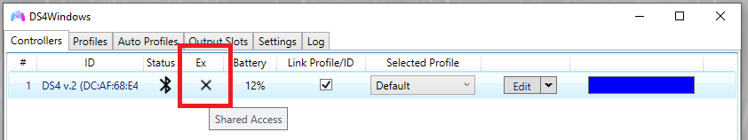
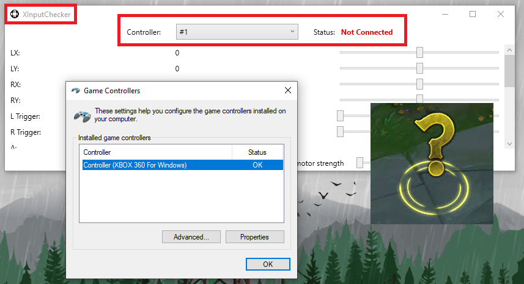
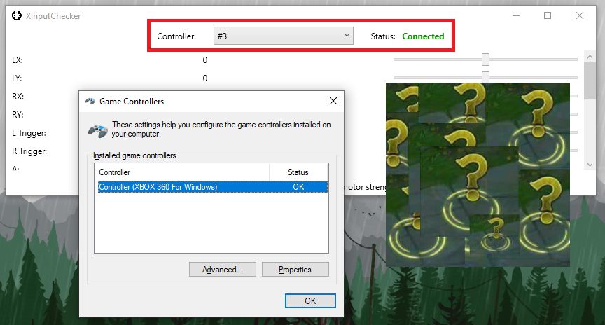
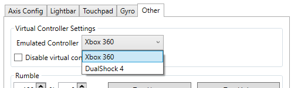
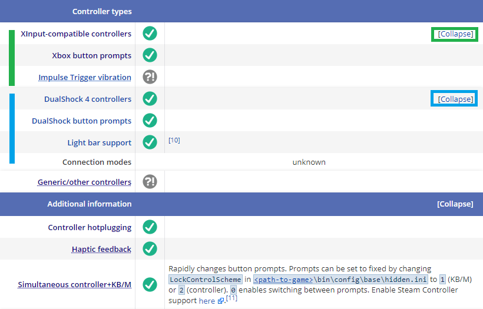
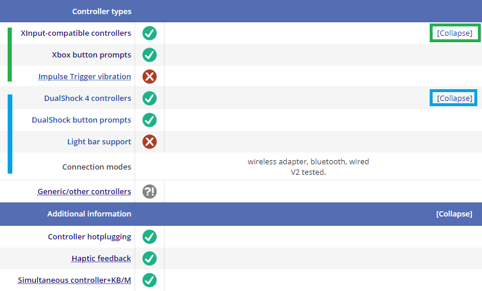
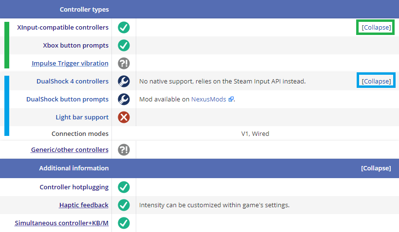
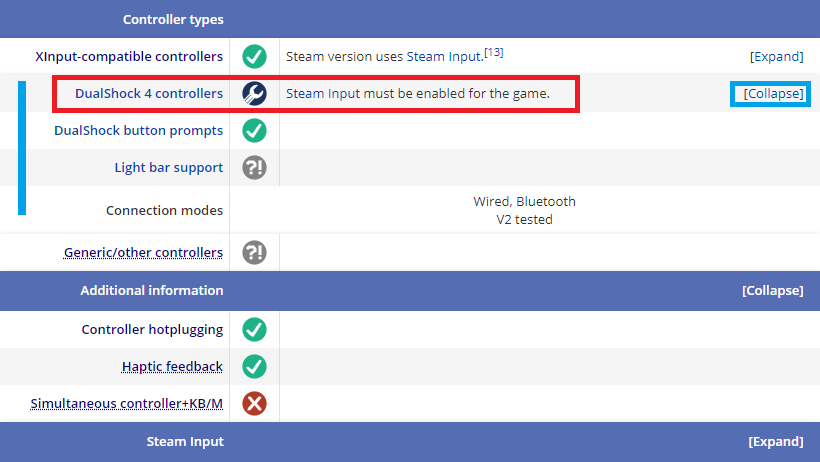

# Games not recognizing the virtual controller (under construction)

## What to fully confirm before anything else

### Making sure the double controller (double input) issue is prevented

!!! info "If there is an `X` on the "Ex" column then it's possible for the double input issue to occur"

    - For users of HidHide, make sure that the `HidHide Configuration Client` is fully closed before opening DS4Windows, otherwise the "Ex" check may fail even though HidHide is correctly hiding the physical controller

    {: .glightbox }  

It's possible for the double input issue to actually make your controller NOT be detected by games, as such it should be the user's number one priority to prevent it before anything else.

This happens because the game may detect the wrong controller (your physical one) first and then keep waiting for its commands while ignoring DS4Windows' virtual one. Depending on how the game "reads" the physical controller inputs it may get stuck in a "nothing happens" situation.

Check the page about [what causes the double controller (double input) issue and how to prevent it](../../guides/solving-double-input/). 

### Confirming the virtual controller is acting as expected

- Test your controller in the [Gamepad Tester website](https://gamepad-tester.com/), check if it responds as normal accordingly to the used profile configurations
- If the virtual gamepad is not acting as expected, maybe your profile is misconfigured. To test, create a new profile under DS4Windows' `Profiles` tab using one of the recommended gamepad presets, save and then select it for your controller in the `Controllers` tab
- If on the gamepad tester website your controller does not respond to any command then double-check again the currently selected profile in the `Controllers` tab and its configuration. Make sure the buttons bindings are actually mapped to something and a blank profile is not being used
- If the [Gamepad Tester website](https://gamepad-tester.com/) is failing to detect the the virtual controller then check the page related to [virtual controller creation issues]()

## Game not recognizing the virtual Xbox controller or stops recognizing it upon controller reconnection

This __may__ be related to a somewhat known Windows issue where it has, hidden from view, associated the connected Xbox controller to a incorrect / not-expected "XInput Slot".  

Check the dedicated [_XInput slots order issues_ page](../../troubleshooting/xinput-slots-order/) for more info on how to check and solve this issue.

=== ""Wait, where is my controller?""

    {: .glightbox }  

=== ""Oh! There it is... WHAT?!""

    {: .glightbox }  

## Common reasons for games to not detect virtual (emulated) DualShock 4 controllers

### Game supports only Xbox controllers

{: .glightbox }  

Most games support only Xbox controllers because of how easy it is to add complete support to them. Even games that were released for Playstation consoles sometimes don't have native DS4 support on the PC, and there is nothing that can be done besides switching to Xbox controller emulation.

A good (but not 100% reliable) way to confirm if a game has native DS4 support is by locating it on the [Pc Gaming Wiki](https://www.pcgamingwiki.com) and looking for the "Input settings" section. Look carefully, sometimes it is quite hidden, so make sure to expand menus when applicable. Still, most games that have support for DS4 controllers don't actually have rumble support, so be warned.

Some games also can be modded to include PS button icons while using Xbox controllers, though it's not possible to cover this here and so you'll have to google it yourself.

!!! info "Game examples on Pc Gaming Wiki"

    === "Full DS4 support"
        
        [Witcher 3' Pc Gaming Wiki page](https://www.pcgamingwiki.com/wiki/The_Witcher_3:_Wild_Hunt#Input)

        - An example of what all PC games ports should be

        {: .glightbox } 

    === "Partial DS4 support"

        [Hades' Pc Gaming Wiki page](https://www.pcgamingwiki.com/wiki/Hades#Input)

        - Sometimes a game appears on Pc Gaming wiki with Haptic Feedback (rumble) support, but it's not clear if it is for both Xbox and DS4 controllers or only for the former
        - Keep in mind that DS4Windows' virtual DS4 controllers are always "wired" regardless of how the physical controller is connected to the PC 

        {: .glightbox }  

    === "No DS4 support"

        [Sekiro's Pc Gaming Wiki page](https://www.pcgamingwiki.com/wiki/Sekiro:_Shadows_Die_Twice#Input)

        - Sekiro has no support whatsoever for DS4 controllers, so Xbox emulation should be used on DS4Windows
        - If using a DS4 controller along with Steam Input (`Playstation Configuration Support`) then Steam will emulate a Xbox controller anyway

        {: .glightbox }  

### Game requires Steam Input to have support for DS4 controllers

!!! info "Want to know more info on this? Check out dedicated [__General info regarding DS4 controller on PC games__ page](../../unders-construction)!" 

Though it's quite uncommon, some games absolutely require using your DS4 through Steam Input by enabling the `Playstation Configuration Support` option and launching the game through Steam to have working DS4 support or to support rumble/lightbar features.

Keep in mind that for using your virtual DS4 controller through Steam Input you'll have to [run DS4Windows under a custom name for Steam to not ignore it](../../guides/ds4w-custom-name/) (thanks for not giving us the option on this and making our lives harder, Steam).  

{: .glightbox }  

## Game intentionally ignore virtual controllers

No known cases. Most users who claimed some game had this behavior were actually having other unrelated issue. Example: Shovel Knight ignores DS4 controllers if it detects DS4Windows is running, but it shouldn't matter if the user is using is using a Xbox controller or if running disguised to not be detected.

Not saying it's not possible, just that it's not known.