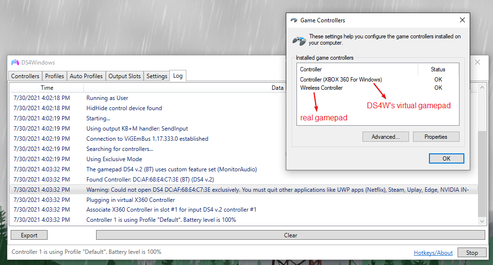
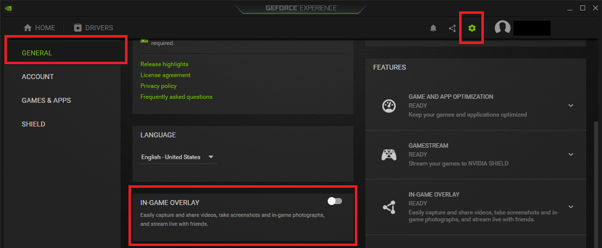
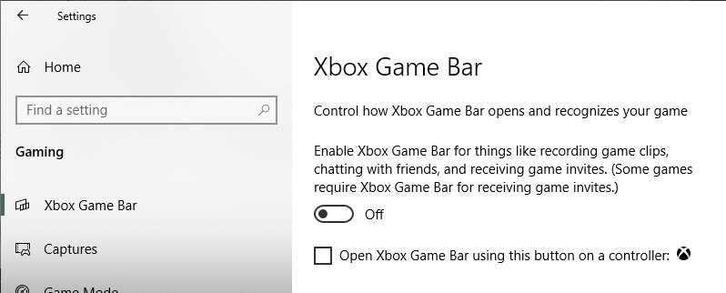
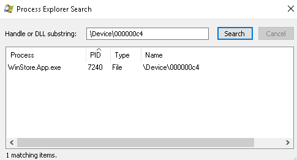

# "Could not open (controller) exclusively" / Hide DS4 controllers option not working

## General info

!!! important "Too long, didn't read:"
    The `Hide DS4 controllers` option is not recommended and [HidHide](../../guides/solving-double-input) should be used instead

The `Hide DS4 controllers` option is a legacy feature of DS4Windows that was used to prevent the infamous [double input issue](../../guides/solving-double-input/). This page is dedicated to explaining why it fails to work sometimes, showing alternatives and, in case the user really needs this option for some reason, to finding out exactly why it's failing and how to solve it.

## Why it's not recommended

When the `Hide DS4 controllers` option is enabled, DS4Windows will attempt to request Exclusive Access to detected controllers, meaning your real (physical) controller would not be detectable by games anymore. By keeping only DS4Windows' virtual controller visible the double input issue can be prevented.

The problem is, if anything already has an open handle to the controller (games, programs, processes) then Windows will deny the Exclusive Access request and your real controller will remain visible. When this happens, DS4Windows will warn the user via the `log` tab as shown in the image below:

{: .glightbox } 

Even when it does work, if the controller disconnects in the middle of a game chances are that the Exclusive Access request will fail upon controller reconnection, requiring the user to close the game/related programs before trying again. As such, this option is not realible and alternatives should be used. 

## Recommended alternatives (HidHide)

The recommended, trustworthy solution for preventing the double input issue is the [__HidHide__ driver](../../guides/solving-double-input/#hidhide-recommended). Once it has been installed and __properly configured__, the user's real controller will be hidden from games and other programs, with only DS4Windows and other chosen processes allowed to detect them.

## Applications known to cause problems with exclusive mode

!!! important
    Even if it looks like a program is not open, sometimes it has a background process running, requiring the user to terminate it via Windows' Task Manager.

To solve problems with exclusive mode you should try to close all other applications which may be using the real controller and then try to re-connect it (or `->Stop ->Start` DS4Windows). If DS4Windows tool is the first application opening a connection to the controller then Exclusive Access can be acquireed and the real controller hidden. After Exclusive Access is obtained it will remain active until DS4Windows is stopped/started or the controller is reconnected. 

__The following is a NOT complete list__ of applications which may be running in your system in the background and may have an open connection to the original DS4 controller. Sometimes very unexpected applications may have an open connection to the physical controller without your knowledge and then prevent DS4Windows to enable the "Hide DS4 Controllers" exclusive mode.

### NVIDIA GeForce Experience and in-game overlay

Disable GeForce in-game overlay feature in NVIDIA options or enable it only after you have started DS4Windows tool.

{: .glightbox } 

### Steam client

Steam client supports "big screen mode" and various gamepad controllers (including DualShock4). Disable gamepad support in Steam client at least for DualShock4 device type.

{: .glightbox } 

### Ubisoft UPlay client

UPlay supports gamepad navigation. Close UPlay client before launching DS4Windows tool.

### Windows Store application

Windows Store application supports gamepad controller navigations. Shutdown WinStore.app.exe process before launching DS4Windows tool. You can launch WinStore application after DS4Windows has already enabled the exclusive mode.

### Netflix (Win 10 app)

Netflix client supports gamepad navigation. Close Netflix client __and terminate its process__ before opening DS4Windows tool.

### Microsoft Edge

The Microsoft Edge browser window needs to be closed and the background task must be ended in Task Manager. You can use local group policy tool to disable automatic startup of Edge background processes on system boot. See the following web page https://docs.microsoft.com/en-us/microsoft-edge/deploy/group-policies/prelaunch-preload-gp how to disable two Edge related group policy entries.

### JoyToKey

The JoyToKey is another gamepad remap tool. Some users have reported that having both DS4Windows and JoyToKey apps running may lead to problems when a gamepad is disconnected. Exclusive mode doesn't work when a gamepad is re-connected after a disconnection or DS4Windows doesn't recognize your physical gamepad at all.

### GameBar (Win 10)

GameBar.exe may hold a open connection to your physical controller. You can disable the Game bar in Settings -> Gaming -> Turn off 'Record game clips, screenshots and broadcast using Game bar', and unselect 'Open Game bar using this button on a controller'.

{: .glightbox } 

### Oculus Rift tools

If you have installed Oculus Rift VR tools then there may be a background process using a gamepad. Stop "Oculus Rift VR runtime service" background service and launch it after DS4Windows application has started and acquired the exclusive lock to your physical gamepad.

### Backgroundtransferhost

This native Windows feature may interfere with exclusive mode. Going to Settings --> Accounts --> Sync your Settings then turn sync off. If that fails to work, the other solution involves regedit - which requires changing the "Start" value in HKEY_LOCAL_MACHINE\SYSTEM\CurrentControlSet\Services\TimeBroker (or timebrokersvs) to 4, a detailed guide can be found [here](https://appuals.com/what-is-backgroundtransferhost-exe-and-should-i-block-it/).

## Finding exactly which process has an open handle to the controller

!!! important "Advanced stuff!"

The application __Process Explorer__ can be used to find out which process currently has an open handle on your physical controller and making exclusive mode fail. The scan takes a little bit of time but it is helpful in finding problem applications. A link to a guide is provided below.

http://www.imatest.com/2017/01/how-to-determine-what-processes-are-using-a-device/

{: .glightbox } 

