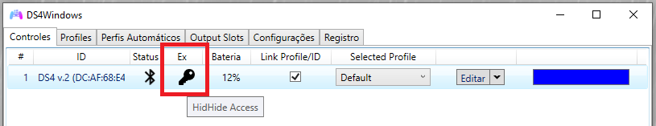

# HidHide usage troubleshoot

## General info

HidHide is a third-party driver that acts as a barrier between every gamepad and games or applications trying to detect them. It's used to hide real (physical) controllers from the system and only allow specific applications to detect them.

It's mostly used to prevent the infamous Double Input issue. For more info on this, check the [_Preventing the double input issue in games_ page](../../guides/solving-double-input/).

## Common problems and issues when using HidHide

### HidHide is installed but the double input issue still occurs

Just installing HidHide is not enough since on its default settings it basically does nothing. It needs to be manually configured to hide specific controllers on its Configuration Client.

### "What should I add to HidHide's Application list?"

Usually only DS4Windows itself since it needs to keep detecting physical controllers even when they are hidden.

Games or other applications should not be on the application list unless you have an specific use-case that requires them to have direct access to your real controller instead of using DS4Windows' virtual controllers.

### "I'm having trouble finding which controller to hide on HidHide's list"

Keep in mind: real (physical) controllers are the one that need to be hidden to prevent the double input issue, but HidHide will show both real and virtual controllers on its devices list.

To not get confused, __the major recomendation is to make sure DS4Windows is NOT RUNNING so no virtual devices are present on the system BEFORE opening HidHide's Client__. The proper steps for this are:

1. Open Windows' [Game Controllers list (joy.cpl)](../controllers-check/#windows-game-controllers-list)
1. __Make sure both DS4Windows is "Stopped" and fully closed, THEN you open the HidHide Configuration Client__
1. Mark the `Enable Device Hiding` checkbox at the bottom of the Devices tab
1. Find your controller in the Devices tab list and mark it, a Red Lock should appear indicating that it is hidden
    - This needs to be done once via USB and once via Bluetooth if both connection methods are used
1. Confirm on Windows' Game Controllers list if your controller has been hidden (click on the list to update it)
	- If the controller was not hidden then you've marked the wrong entry. Un-do the change and try again
	- Reconnecting the controller may be required
1. __CLOSE__ HidHide Config. Client and only then open or Start DS4Windows

### "How do I confirm my physical controller is really hidden?"

#### Verifying on DS4Windows

Verify on DS4Windows' `Controllers` tab if the "Key" icon is present on the connected controllers' `Ex` Column.

!!! important
	- The `Ex` check can fail if the HidHide Configuration Client (or other program using HidHide) is open when DS4Windows starts
	    - This makes no difference on if the controller is properly hidden or not, DS4Windows just will fail to inform you in case it really is
    - Keep in mind that DS4Windows only verifies if a controller is hidden on connection or if DS4Windows is restarted.

{: .glightbox } 

#### Manual method

To "manually" verify if a controller has been successfully hidden:

1. Make sure that DS4Windows is Stopped or fully closed, otherwise you might mistake a DS4Windows' virtual controller with your real one
1. Verify on the [Gamepad Tester Website](https://gamepad-tester.com/) and on [Windows' Game Controllers list](../../troubleshooting/controllers-check/#windows-game-controllers-list-joycpl) if your real controller is still detected
	- It's recommended to reconnect the controllers after hiding them for the changes to take full effect, otherwise some applications might continue to still detect them
	- If your controller is detected/appears on the list then your controller is obviously not hidden. In this case, re-configure HidHide
	- If your controller is not detected then it has been successfully hidden and the double-input issue should be prevented

### DS4Windows failing to detect hidden controllers after having them hidden

- Open HidHide Configuration Client and manually add DS4Windows.exe on the `Applications` list
	- If DS4Windows is running under a custom .exe name also add the custom named .exe file to the list

### "I've hidden my controller but still suffer from double input"

- Make sure the `Enable Device Hiding` checkbox is marked on HidHide's Config Client `Devices` tab
- Try reconnecting the controller
- Fully confirm if the controller is hidden by using the "Manual method" on this page
- If the controller is used via both USB and Bluetooth remember that it needs to be hidden once via USB and another via Bluetooth
- Sometimes a controller can be marked as hidden but remain visible. In this case, verify all the marked entries in the list and just uncheck and re-check them
    - This usually happens if a Bluetooth connected controller that was hidden has been removed and re-paired
	- Reconnect the controller after re-marking them as hidden