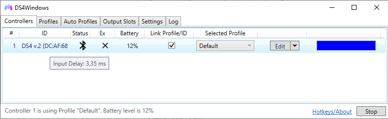
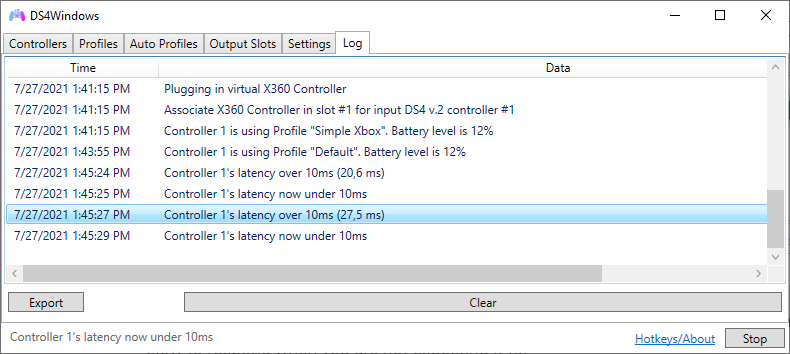
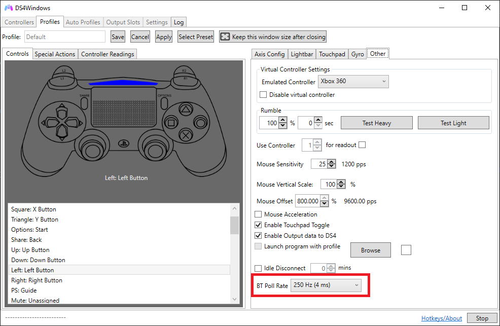
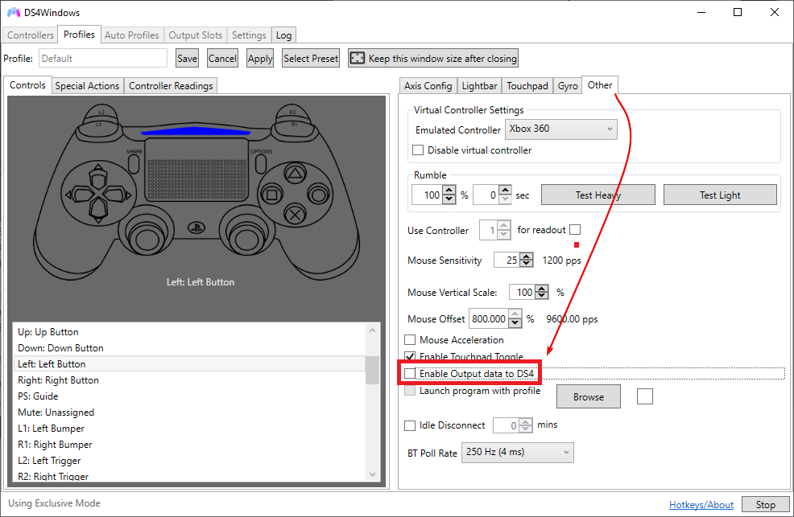

# Latency/input delay issues on Bluetooth

## General information

A connection latency is how much time it takes for one system to communicate to another. In DS4Windows case, we refer to the time it takes for the system/DS4Windows to communicate with the controller. A high latency means a high **input delay** in games, meaning the time it takes for your character to respond to the controller commands.

{: .glightbox }  

A high but stable input delay will make the users' character feel slow to respond, while a low input delay with high delay spikes may make the user prone to errors because of unexpected slow respond times.

It's often considered that a really bad high latency is one where the input delay is above 20ms, though the ideal is to keep it bellow 10ms.

## Usual controller latency

The following table can be used as reference for comparison on what input delay to expect with a supported controller and a good Bluetooth adapter: 

!!! important "Take these values with a grain of salt"
	No major technical experiments were done to obtain these values besides checking what DS4Windows usually informs when those controllers are used at maximum BT polling rate

| Controller | Usual input delay | Minimum input delay | Notes |
| :---: | :---: | :---: | :---: |
| DualShock 3 | 5ms | 5ms | Connected through `BthPS3` + `DsHidMini (DS4Windows Mode)` |
| DualShock 4 | 4ms - `DS4W Default settings` | 1,5ms - `polling rate set to maximum` | v1 and v2 don't have major latency differences |
| DualSense | 3ms | 1ms |  |
| Switch Pro controllers | 16ms | 16ms  | 16ms is the lowest latency the official controller can achieve |
| Joy-cons | 16ms? | 16ms? |  |

## Monitoring input delay

- You can check the current input delay by hovering your mouse above the controllers name on the `Controllers` tab (check the image above)
- If the controller's latency goes over 10ms then it will appear on the Log
- If you have a DualShock 3, DualShock 4 or DualSense you can enable the `Flash Lighbar at High latency` option in the `Settings` tab, which will make the lightbar flash in a red color when latency spikes are detected.

!!! note "For the DualShock 3 you need to have DsHidMini's `Lightbar to LED translation` enabled, then latency spikes will cause all 4 LEDs to quickly flash"

{: .glightbox }  

## Input delay issues

In case you are having issues with input delay, keep something in mind: **DS4Windows itself is probably not the cause of whatever high input latency/latency spikes that you may have!** 98% chance of the issue being elsewhere.

Controllers do not communicate directly with DS4Windows via some driver, they connect to the default Windows' Bluetooth Stack and DS4Windows just receives and sends data to it through the channels given by Windows.

If you are having latency issues then installing/uninstalling drivers won't fix them unless they are directly related to your dongle's driver. For this reason, messing with DS4Windows' [related drivers]() will probably be a waste of time. 

Latency issues always boils down to:

- Low quality Bluetooth adapters (most integrated ones)
- High radio interference near the adapter
- Too many devices connected to the adapter
- Not using the correct/updated BT adapter's driver

## Causes of high or unstable latency

!!! note "Note on "Bad" BT adapters"
	Keep in mind that when the term "bad" is used it does not necessarily mean "cheap". Multiple users have confirmed they have no latency issues even with 4 controllers connected with cheap, generic $5 adapters from Aliexpress

### Bluetooth and WiFi interference

Both use the same frequency. Although they should auto adjust to prevent interference, sometimes it just happens. Check if your area isn't overloaded with different 2.4Ghz WiFi networks and Bluetooth devices. Also, if one of the signals is too weak then it's quite easy for the other to heavily interfere.

### Integrated or bad Bluetooth adapters

It's quite common for integrated BT adapters to suck for one of the following reasons:

- They are inside the laptop's shell or inside a case that act as an obstacle to the signal
- The Bluetooth adapter also is the WiFi adapter and they are both interfering at each other
- They are just being overrall bad. Integrated BT adapters generally have short range and can't maintain the minimum data rate necessary when connecting more than 1 controller. Good integrated adapters are the exception, not the norm

Though the minimum BT specification required for most modern controllers is the 2.1 specs, more modern adapters should have better signal stability.

### Multiple connected controllers

Each connected controller means more data that is being transferred through the Bluetooth adapter. If you have a bad adapter or high radio interference near it it may not be able to maintain the required data rate between the system and controllers, causing high latency or even connection loss. Not much can be done besides trying to lower the interference or replacing the adater with a better one.

A good quality adapter can easily maintain a stable, low latency connection with 4 controllers or even more.

### DS4Windows causing controller to increase data transfer rate

!!! important "This only applies to DS4 and DualSense controllers"

DS4 and DualSense controllers can communicate in 2 different modes:

- PC friendly mode: only basic button/axes information is sent by the controller to the PC
- Native PS mode: controller sends its full set of information, including motion sensors data, status, touchpad states etc

When first connected to Windows, these controllers communicate in PC friendly mode and their data transfer rate is low. When picked by DS4Windows (or Steam for that matter), a request is sent for them to change into Native PS mode, which increases the volume and the frequency of data being sent.

Not only that, DS4Windows also sends data back to the controller related to the rumble, lightbar, triggers (DualSense only) etc.

When these changes occur, if the Bluetooth adapter can't keep up with the required data rate then the user may suffer with high input delay or even connection loss. So if your never had latency problems when using your DS4/DualSense in games as a generic controller but then start having issues when trying to use DS4Windows or Steam this may be the cause.

## Potential fixes to latency issues

### Test with WiFi fully disabled

!!! note "This test is recommended for those with integrated cards that work as both BT and WiFi adapters"

By disabling the WiFi signal you have one less source of radio interference so you can then verify your BT adapter performance in a environment with less signal noise. Keep wifi enabled devices far from the PC too.

### Settings Windows' Power Plan to High Performance

- Set the power saving plan of the PC to "High Performance" (usually the default in Win10 is balanced)
- On Windows' Device Manager locate your Bluetooth Dongle -> Enter its `properties` -> Check if there is a tab called `Power Management` and disable the `turn off this device to save power`  (untick the option)

### Use a dedicated BT adapter

!!! important "Even if a dedicated adapter is already being used consider that it might be faulty or of bad quality"

A dedicated, good quality BT USB Adapter should offer better performance than an integrated one. Because its antenna is located outside of the laptop/desktop's shell, it also suffers less from signal loss caused by physical obstacles.

When using a USB adapter in a PC that also has a integrated one the later must be disabled in Windows' `Device Manager` in order for the USB BT adapter one to be used, since Windows can only keep one dongle active.

{: .glightbox }  

### Moving the adapter to another USB port

Moving the dongle to a better located USB port may offer a better quality signal. Also, USB ports (specially 3.0 and above) can be a source of radio noise. Test the dongle in different ports to verify which offer you a better signal.

### Connect USB BT adapter through a USB extension cable

A laptop/desktop's shell is a source of radio noise, specially if it's ungrounded or near high powered, high data transfer ports like USB 3.0 and above. This noise may worsen your BT's adapter performance.

Connecting your BT adapter through an active cable extension, so it stays located at some distance from the computers shell (not _necessarily_ nearer to the controller), is known to be useful in these cases.

### Decrease the BT polling rate on profile settings

!!! note "Only works with DS4 gamepads. The BT polling rates of other types cannot be controlled"

On `Profile Editor` -> `Other` tab it's possible to set the `BT Poll Rate` used for DS4 and DualSense controllers on Bluetooth. If you are having latency issues, specially with multiple controllers connected, try setting this value to 10ms or more. For most games, a controller input delay is only noticeable above 16ms.

{: .glightbox }  

### Disable output data to the controller

Your adapter may not be up to the task to both receive _and_ send data to the controller. In this case, you can set a profile with the `Enable output data to DS4` option disabled. Keep in mind that disabling this option will also disable Rumble and Lightbar control.  

{: .glightbox }  