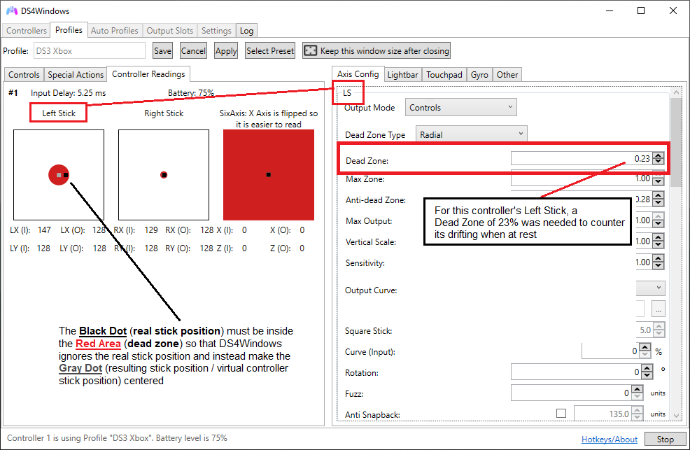

# Keyboard & Mouse (KB+M) remapping issues

## General info

This page is mainly focused on KB+M control not being detected by games and aplications or other common issues. Instructions on how to tweak the remap settings to your needs will not be covered here since this will the job for a future guide (no promises on this though).

## About DS4Windows' KB+M handlers

!!! info "TO DO: Improve this section" 

The KB+M handlers are the means by which DS4Windows sends keyboard and mouse actions. Currently the 2 handlers used are the SendInput and the FakerInput handler. 

### SendInput

The SendInput handler requires no driver and it's used by default when the FakerInput driver is not installed.

Unfortunaly, some games and Windows' events may end-up ignoring commands coming from SendInput for a variety of reasons, with a few examples being:

- Windows' preventing malicious software from taking control of the user's system
- Games' anti-cheat protection
- Games simply not recognizing commands coming from the SendInput function

### FakerInput

The FakerInput handler does not suffer from the limitations of the SendInput handler, but it's usage requires its driver installation. It's also currently in beta and the user may suffer from unknown issues.

When it's active, DS4Windows' KB+M commands are sent via the FakerInput and received by the system as non-different than a real keyboard and mouse, meaning Windows and games will accept its commands even in situations that virtual KB+M usage are blocked.

## Verifying / changing current KB+M handler being used by DS4Windows

You can check on DS4Windows' `Log` tab which handler is being used.

{: .glightbox } 

DS4Windows always uses the FakerInput handler if its driver is installer, so to switch between handlers it's a matter of installing or [uninstalling](../../guides/uninstalling-ds4windows/#related-drivers) the FakerInput driver and then restarting DS4Windows.

=== "Installing FakerInput"

	!!! important "Restart DS4Windows after the installation"

	{: .glightbox } 

=== "Uninstalling FakerInput"

	!!! important "Make sure DS4Windows is not running when uninstalling the FakerInput driver"

	{: .glightbox } 

## Common issues

### Mouse drifting or keyboard typing by themselves

This usually happens when the KB & M are mapped to the controller's sticks but these are suffering from the "stick drifting at rest" issue, which happens when the controller's sticks are not correctly centered when at a resting position.

To counter this, the sticks' __Dead Zone__ must be increased until it's big enough to emcompass the real controller stick's resting position. For more info on the stick drifting at rest, check the [_Camera or caracter moving by themselves_ section in the _controller misbehaving_ troubleshooting page](../../troubleshooting/misbehaving-controller-ingame/#character-or-camera-moves-by-themselves)

!!! info "Minor stick drift workaround"

	{: .glightbox } 

### Windows not responding to DS4W's KB & M commands in some situations

Some situations, mainly in User Account Control (UAC) warnings/prompts, will make Windows ignore DS4W's commands if the SendInput handler is being used. This happens as a Windows' protection against malicious software that try to abuse the SendInput function to take control of the user's system.

The possible fixes for this are:

- Fully disabling Windows' UAC (not recommended)
	- This will not fully solve the issue as there are situations where Windows will still prevent the SendInput handler from working
- Switching to the FakerInput handler
	- FakerInput's KB+M are recognized by the system/games as non-different than a real keyboard and mouse
	- It's in beta test (v0.1) and the user may face some not-known issues 

### Game doesn't respond to DS4W's KB/M commands

#### The usual...

This usually happens if the SendInput handler is being used in a manner similar to the topic above (have a read on it), though the difference is that some games do this as an anti-cheat counter-measure. 

The only real fix for this is switching to the FakerInput handler, which the game usually can't differentiate between it and real KB & M devices being used by the user. 

#### Special cases (Valorant and possibly others)

Some games have really strong anti-cheat protection that both:

1. Ignore the SendInput handler commands, requiring the __FakerInput handler__ usage and
1. Ignores every Keyboard and/or Mouse commands not being received by the main devices in the system

Usually, this "main device" verification is done the moment the game is being launched by detecting which KB/M is the first to send commands. These first devices will be recognized as the "main" user devices and every other one will then be ignored.

The workaround to this is to either:

- Unplug the main KB/M when launching the game or
- Not use the real KB/M (keep the mouse completely still, do not use any buttons) when launching the game and use only DS4W's KB/M until its commands are detected
	- After the game correctly recognizes DS4W's KB+M commands the game will then start ignoring the real KB/M
	- Depending on the game, the real KB/M usage may be ignored even outside of the game as long as it's still running
	- Valorant only affects mouse detection/usage inside and outside of the game while it's running. All keyboards in the system function as normal

### KB/M commands not working when being sent via MACROs

!!! note "Section to be re-worked"

If keyboard events are sent too fast Windows may not register that they happened. It is advised that the user:

- OR Manually adds a wait time between the key press and release commands
    - 100ms is the recommended minimum wait time
- OR Activate the `Record delays` option when recording a MACRO, which will make the MACRO recorder auto-register the time it takes for the user to send commands (only starts registering the time after the first command is sent)
    - Depending on the key sequence being registered this may not work. Example: trying to record `Alt + Tab`, the `Win` key and some others combinations won't work since pressing these keys or key combination will un-focus the MACRO recorder window, making it stop registering some/all the keys being used.

{: .glightbox } 