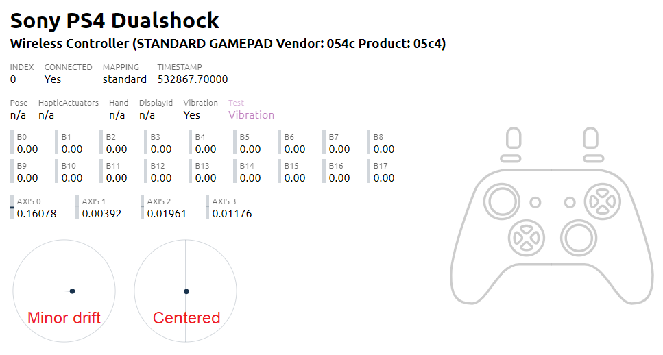
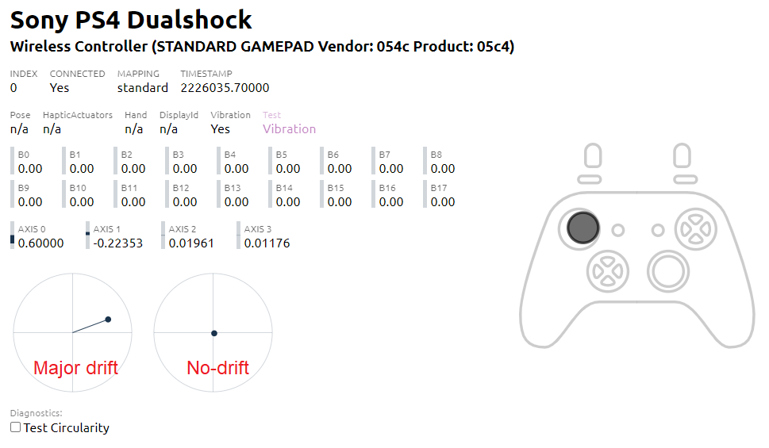
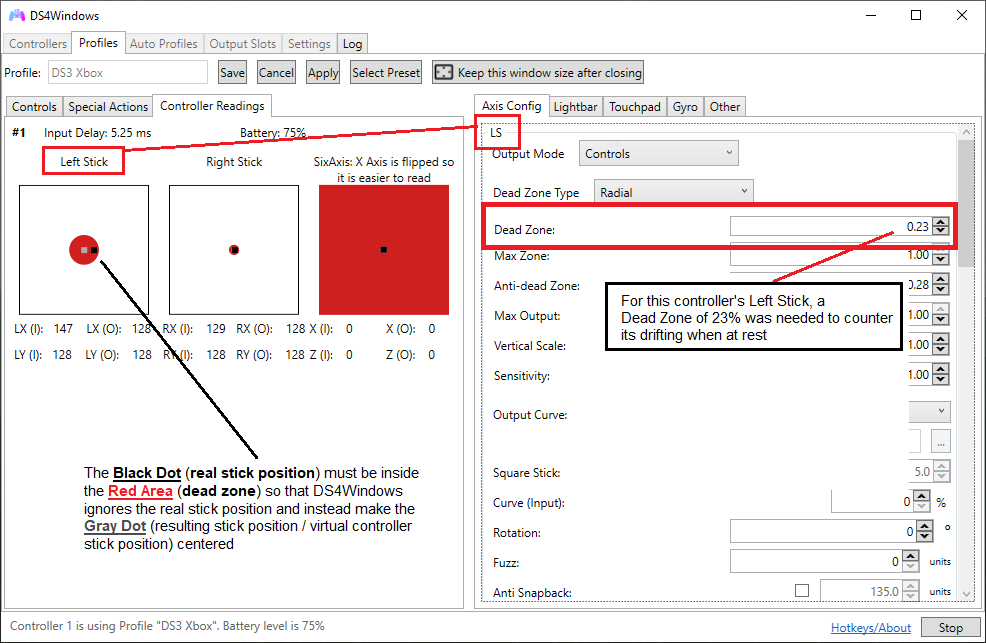

# Controller not behaving correctly in-game

## Things to fully confirm are working well before checking the rest

### Confirm if the double input issue has been prevented

It's essentially the major reason for users having problems playing games with DS4Windows. To not keep repeating information all over the site, check the [double input page](../../guides/solving-double-input/) for more information on that.

Make sure your real controller is 100% hidden before playing games, otherwise you might start having double input/controller issues and mistake them for something else.

!!! info "If there is an `X` on the "Ex" column then it's possible for the double input issue to occur"
    
    - For users of HidHide, make sure that the `HidHide Configuration Client` is fully closed before opening DS4Windows, otherwise the "Ex" check may fail even though HidHide is correctly hiding the physical controller

    {: .glightbox }  

### Test with a new, "clean", properly-functioning profile

It's possible that the currently active profile is misconfigured, either by incorrectly tweaking settings or by having it broken after a DS4Windows update (really rare to happen, but possible).

To not go into a wild goose-chase, the very first thing that should be done is creating a new, sure-to-be-working profile:

1. Go to DS4Windows' `Profiles` tab and click on the `New` button to start profile creation
1. A window will appear asking if the user wants to use a Preset. Select "Yes" then choose a `Gamepad` preset with Xbox or DualShock 4 output
1. Choose any name for this profile (e.g.: "testing") then save it
1. Go back to the `Controllers` tab and select the new profile 

This should result in a good profile for troubleshooting most issues.

## Most common issues

### Character or camera moves by themselves

This is usually caused by the "stick drifting" issue, which happens when the controller stick position is not perfectly centered when at rest and can be possibly caused by 2 different hardware issues:

- The stick is not physically snapping back to its center or
- The stick being physically centered but the sticks' position sensors not correctly reading its position

When using a preset Xbox profile (default settings), for the drift to not occur the stick's resting position must be below 8% of the total "movement" range. If above 8% then the stick position will fall outside of the default `dead zone` and DS4Windows will think the user is intentionally moving the stick.

If using a DS4 __preset profile__ (not related to the real controller you are using) then there are no (Anti) Dead Zone configured and DS4Windows just directly repasses the real stick position to the virtual DS4 controller.

!!! info "Instructions on how to properly verify the stick behavior"

    1. Create a new profile and choose one of the Gamepad Presets DS4Windows recommends. Then adjust it to the following:
        1. Make this profile's name "stick position test"
        1. Set both the `dead zone` and `anti dead zone` to `0.00` in this new profile for both sticks (LS and RS)
    1. Select this profile on the main `Controllers` tab everytime you want to test your real stick behavior
    1. With this profile active, open the [Gamepad Tester Website](https://gamepad-tester.com/) and verify if your stick is correctly centered when at a resting position
        - Check the actual value of the axes. Values above `+/- 0.08` are enough to cause drifting issues on DS4Windows default settings 
        - Even if it appears to be centered, try moving it to different positions and let it snap back to the center on its own many times to fully confirm it's properly functioning
        - It's recommended to make this test MANY TIMES and at different periods. Sometimes the drift appears or disappears randomly, making it hard to properly confirm if the stick is 100% _OK_
        - If possible, when the random camera movement is perceived mid-game try to quickly alt-tab and test this to check the stick position

A minor but constant drift can be workarounded by increasing the `dead zone` (check the `Minor drift workaround` example below).

If you are suffering from major drift then there's not much that can be done besides repairing the controller itself. Depending on the controller, it can be fixed by cleaning the sticks' resistor-meters (not so hard to people who are confident of their DIY abilities) or fully replacing the sticks (advanced stuff, take it to the assistance).

!!! info "Stick drift issue and workarounds"
    
    - When not being moved, the sticks positions must be centered

    === "Issue example (minor)"

        - The Right Stick is at the correct resting position
        - The Left stick's horizontal axis is slightly drifting to the right (`axis 0 = ~0.16`)
            - This can be "fixed" by increasing the `dead zone` on the profile settings 

        {: .glightbox } 

    === "Issue example (major)"

        - The Left Stick's both axes are suffering from major drifting issues
        - Setting a dead zone big enough to counter this might greatly affect gameplay and even make games unplayable
            - Fixing it requires cleaning the stick sensors or replacing the stick (not for the average user)

        {: .glightbox } 

    === "Minor drift workaround"

        - The Black Dot (real stick position) must be inside the Red Area (Dead Zone) so that DS4Windows makes the Gray Dot (Virtual Stick Position) centered
        - For this controller's Left Stick, a Dead Zone of 23% was required to counter its drift

        {: .glightbox } 

### Occasionally character or camera moves in a random direction or not respond to the exact movement that is expected

This is __usually__ related to a hardware issue called "Stick drifting" that happens when the controller's not correctly reading the stick position, which can cause it to "jump" to random positions when using it. To verify, it's needed to verify the stick in all possible positions:

!!! info "Instructions on how to properly verify the stick behavior"

    1. Create a new profile and choose one of the Gamepad Presets DS4Windows recommends. Then adjust it to the following:
        1. Make this profile's name "stick position test"
        1. Set both the `dead zone` and `anti dead zone` to `0.00` in this new profile for both sticks (LS and RS)
    1. Select this profile on the main `Controllers` tab everytime you want to test your real stick behavior
    1. Open the [Gamepad Tester Website](https://gamepad-tester.com/) 
    1. Do, slowly, a cross movement by makign the stick position go up-and-down, left-and-right. Test both sticks separately
    1. Also, slowly do a full circle movement a few times
        - It's recommended to make the 2 tests above MANY TIMES and at different periods. Sometimes the drift appears or disappears randomly making it hard to properly confirm if the stick is 100% _Ok_

If when testing the stick position corresponded to the movements of the real stick then all good. If not, if somehow it jumped position or behave erratically then your controller probably is physically faulty. Depending on the controller, it can be fixed by cleaning the sticks' resistor-meters (not so hard to people who are confident of their DIY abilities) or fully replacing the sticks (advanced stuff, take it to the assistance).

!!! info "Example of how proper functioning sticks moves like"

    {: .glightbox } 

### Buttons / triggers pressing themselves randomly or not registering properly

Random inputs are 99.9% of the time caused by the controller itself being faulty, not by DS4Windows or other drivers.

If the issue is in the triggers, it's possible to try increasing its/their dead-zone to require pressing them further before being registered.

One way to test if you are having random buttom presses is by creating a profile that has a `Special action` enabled that causes a profile switch to _another_ profile when a specific button is pressed, then just leave your controller turned on and wait, or maybe try slightly touching the buttons without fully pressing them to see if its a sensibility issue. 

Other than that, the only thing left to do is taking the controller to the assistance.

!!! info "Usual reaction when users say it's a Windows' driver error"
    {: .glightbox } 

### Controller stops responding randomly

Unless DS4Windows is out-right crashing or appearing to be frozen (Windows says that it is not responding) then it is probably an issue with your controllers cable, its own USB port, the PC's USB port or if connected via Bluetooth then a [latency issue](../../troubleshooting/bt-connection-issues/).

For wired users, try using other PC USB ports, replacing the cable or testing if the problem does not occur when connected over Bluetooth.

Besides that, check if there isn't any error message in DS4Windows' Log that could give some direction on this.

### Game constantly or occasionally feels slow to respond to commands (high input delay sensation)

- May be an issue with the game itself
- If the controller is connected via Bluetooth then you may be having connection issues which result in [high input delay or random latency spikes](../../troubleshooting/input-delay-bt/)
- Controller latency can be monitored by hovering the mouse over the controllers' name on DS4Windows' main `Controllers` tab. Also, if the latency goes above 10ms then it will be registered on the `Log` tab
- If you are connected wired but DS4Windows is alerting you of high input delay (over 20ms) then probably the cable is faulty, or even the PC or controller's USB port

### Game feels slow to respond to commands only when using a virtual DS4 (HidHide related)

This was an issue with HidHide that was fixed on v1.1.50. Make sure to update to the [latest available HidHide version](https://github.com/ViGEm/HidHide/releases).

### Game has native support to DS4's rumble, motion, gyro, touchpad and/or lightbar but it does not work

!!! important "Rumble and lightbar passthrough are currently disabled when DS4 emulation is active"
    - Because of an issue with the ViGEmBus, DS4Windows has disabled support for rumble and the Lightbar passthru mode when using virtual DS4 controllers
    - The issue causes the controller to occasionally not stop rumbling or to set wrong lightbar colors
    - The last version to have these features enabled was v3.0.10. Keep in mind that these features may or may not work well with games in this version and support will not be given to users that aren't to the latest version

- Are you reeeeeally sure it actually has support for those features? One good way of knowing, though not 100% reliable, is by looking in your games' page on the [PC Gaming Wiki](https://www.pcgamingwiki.com/wiki/Home) and checking in the controller section if it has 1) DS4 Controller support and 2) if it's specifically stated that those functions are supported
- Make sure you are using a emulated DS4 controller and that you've [enabled the corresponding passthru options that you intend to use on the active profile](../../other/under-construction)
- Sometimes, for a game to have support for these features (or to even detect DS4 controllers) the following conditions are required: 1) launching the game through Steam and 2) Using the DS4 controller through Steam's `Playstation Configuration Support`. For more info on that, please check the [Steam related info page](../steam-related)

### Rumble does not work

!!! important "Rumble and lightbar passthrough are currently disabled when DS4 emulation is active"
    - Because of an issue with the ViGEmBus, DS4Windows has disabled support for rumble and the Lightbar passthru mode when using virtual DS4 controllers 
    - The issue causes the controller to occasionally not stop rumbling or to set wrong lightbar colors
    - The last version to have these features enabled was v3.0.10. Keep in mind that these features may or may not work well with games in this version and support will not be given to users that aren't to the latest version

- Check on your profile settings' `Other` tab if the rumble is not at `0%` 
- Still on the `Other` tab test there if both your motors are working. If they don't work there then it's a hardware issue with your controller or you have a third-party / copy-cat controller that doesn't have rumble or does not work with DS4Windows 
- Most games only have working rumble when using Xbox controllers even if the game supports both Xbox and DualShock 4 controllers
- Some games only support DS4 controllers or DS4 controller rumble when using Steam's `Playstation Configuration Support`. Read the previous topic for more info on that 
