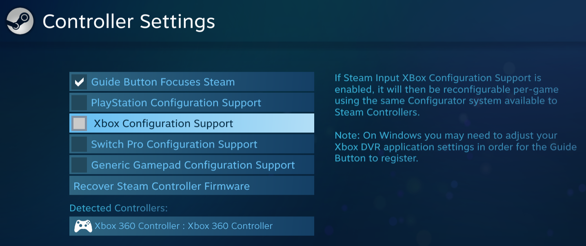

# Steam related information and issues

!!! important "This page sucks and needs to be reworked."

## Issue: cannot control Big Picture using a DS4 / Steam doesn't recognize DS4 controllers

Steam ignores every real or virtual DS4 controller if it detects DS4Windows is running. To work around this, it is necessary to [run DS4Windows under a custom ".exe" name](../../guides/ds4w-custom-name/).

## General info regarding Steam's `(Controller type) Configuration Support` options

{: .glightbox } 

DS4Windows and Steam (Steam Input to be exact) are both input remapping softwares, which allow the user to re-bind buttons, sticks, adjust the lightbar color of DS4 and DualSense, control the keyboard and mouse via the controller and etc. 

The biggest difference is that DS4Windows acts system-wide: virtual controllers spawned by it and other features like keyboard and mouse control work in any game from any game store. Steam's features only function through games and applications launched directly through it.

Now, the question is: if the user can use DS4Windows already to fully configure a controller, why would they also use Steam simultaneously for the same purpose?

Having both Steam and DS4Windows remapping your controller can easily lead to confusion. When your controller starts act strangely, which is misconfigured: Steam or DS4Windows? 

Though Steam do is a powerful tool, isn't it redundant for users of DS4Windows? So, the final question is:

## "Do I need these options enabled for Steam games to recognize my controller?"

### The simple answer

No, you can disable those options and games should have no trouble recognizing your controller. Keep in mind that [not all games have native support for DS4 controllers](../../other/under-construction), and of those that do have most of the time don't support its force-feedback (rumble) functions or lightbar.

### The long answer

This actually is a really complicated topic. Steam does LOTS of things under the hood to try ensuring controller compatibility and other stuffs. So, the fact is:

- Steam Input makes some old games playable with modern controllers
- Some games natively support DualShock 4 controllers with Playstation button icon but require Steam's `Playstation Config(...)` to have working force-feedback (rumble)
- Some games fully rely on Steam's `Playstation Config(...)` to detect DS4 controllers and display Playstation button icons / have working rumble / lightbar control
- Some games add support specifically to the Steam Input API in order to not have to add specific controller support. This way, any controller that can be used with Steam itself would then be usable in those games since Steam would be the one doing the "translation"
- And more

Basically, Steam intention is to become a foundation where games build their controller support upon. It's a complicated topic which won't be explored further here. Do your search!

