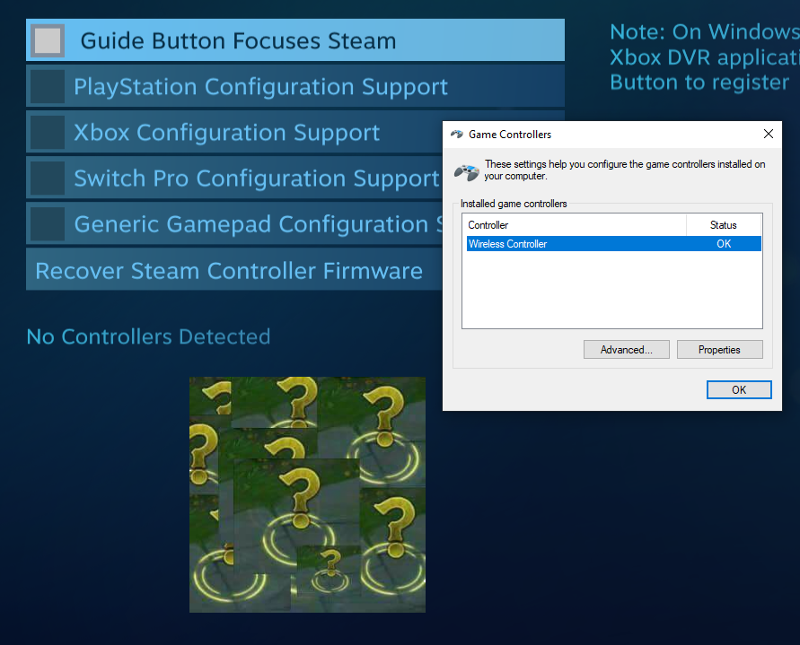
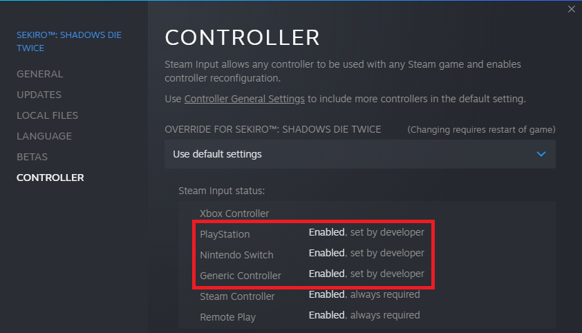

# Steam related issues

## General Info and recomendations

!!! important "Related page"

    Check our dedicated [Preventing conflicts between Steam and DS4Windows](../../guides/prevent-steam-conflict) for general guidance on most Steam realated situations.

### Info on games that absolutely require Steam Input to have working PlayStation controller support

The vast majority of games have native DS4 controller support and will detect DS4 controllers regardless if Steam itself is ignoring them.

_Some_ Steam games have PS controller support only _through_ Steam Input, meaning Steam Input is acting as a compatibility layer between the controller and the game. For these cases, the user would need to:

1. Emulate a DS4 controller through DS4Windows
    - There are other situations that do not _exactly_ fit this situation, but the general directions should be similar
1. Make Steam stop ignoring PS controllers when DS4Windows is running (read relevant section about this on this page)
1. Follow the "Instructions on how to prevent remapping conflicts" **section** on the [dedicated Steam related guides page](../../prevent-steam-conflict)
    - More specifically, instructions on how to use DS4Windows + Steam Input

## Common issues

### Steam ignoring PlayStation controllers when DS4Windows is running

!!! warning "Important!"

    - This behavior does not affect the user if they are emulating a Xbox controller, nor interfere with most use cases of using emulated DS4 controllers with Steam games
    - Most users don't need to waste time with this unless they:
        - Want to control Steam's Big Picture when using a virtual DS4
        - Have one of the few "special case" games that require Steam Input to have working DS4 controller support

{: .glightbox } 

If Steam detects that DS4Windows is running it will start fully ignoring every DS4 and DualSense gamepad (real or virtual) on the system on its own way of preventing the _double input issue_. It has this behavior because Steam is expecting the user to be emulating an Xbox controller and is unnecessary in case the user has properly [prevented the double input issue](../../guides/solving-double-input/) already.

Because Steam ignores PS controllers:

- Users won't be able to interact with Steam's **Big Picture** interface when using a real or virtual PlayStation controllers
- Users won't be able to use real or virtual PlayStation controllers through Steam Input

To evade Steam detection and make it stop ignoring PS controllers, the user needs to [run DS4Windows run under a custom ".exe" name](../../guide/ds4w-custom-name/).

Keep in mind the following:

!!! info "Big Picture usage with PS controllers dos not require Steam's "PlayStation Configuration Support" to be enabled"

    Steam only needs to stop ignoring PS controllers altogether to fix their usage with the Big Picture Interface

!!! important "Steam itself does not need to detect PS controllers for them to work with the majority of games that have native DS4 support"

    - Games that have native support to DS4 controllers will detect them regardless if Steam itself is not
        - There is an exception to this rule, though. Read the next topic for more info

### Steam force turning ON its Configuration Support on specific games

Some few games forcefully enable the "PS/Xbox Configuration Support" options regardless if they are disabled on Steam's general controller settings.

If you want to fully disable these options for those games, you need to:

1. On Steam game list enter into the game's properties
1. Check the "controller" section inside the properties window
1. Change from the "Use default settings" option to "Disable Steam Input"

{: .glightbox } 