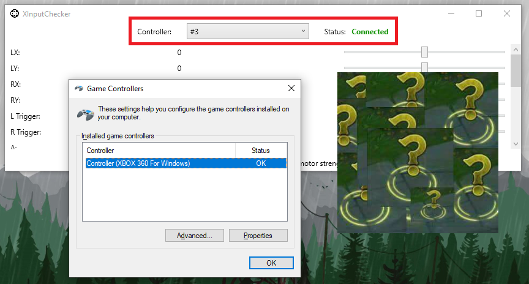

# XInput slots order issues

!!! important "Under construction ⚒️"

## General info

Upon connection, Xbox controllers are associated by Windows to hidden Xinput Slots that range from 1 to 4. After being associated they remain so until being unplugged, which should then make Windows clear the used slot... "Should".

Sometimes processes keep an open handle to these slots in order to remember the previous controller order in case there is an accidental disconnection... Or sometimes those processes are badly coded and just suck. When this happens, slots can get stuck in a constant "reserved" state where controllers being connected or reconnected are pushed down to other XInput slots or are always reconnected to the same ones even though the user is trying to change their order. 

Because this is an automatic Windows process, when a slot gets stuck there is not much DS4Windows can do besides hoping the slots get freed by the offender process next time it tries to connect the virtual controller.

=== ""Wait, where is my controller?""

    {: .glightbox }  

=== ""Oh! There it is... WHAT?!""

    {: .glightbox }  

Having stuck slots can lead to controller detection issues since some games require the main controller to be specifically in Slot 1 (or in the original slot the controller was initially detected) and some other ones have local multiplayer that make the player order directly tied to the XInput slots order.

To solve this issue, it's necessary to find which programs are keeping an open handle to the XInput slots and terminate them.

## Verifying which slot controllers are being associated to

- Have at least one Xbox controller connected
- Go to DS4Windows' `Settings` tab and open the `XInputChecker` tool
- Check each slot to see which of them are connected. When finding a connected slot, make sure to confirm if it is associated t your controller by checking if it responds to commands

## Finding out what is keeping an open handle to XInput Slots

- [Download and extract the Process Explorer archive](https://docs.microsoft.com/en-us/sysinternals/downloads/process-explorer)
- Execute the `procexp64.exe` to open Process Explorer
- Click at the `Find` tab on the top and then select `Find Handle or DLL...`
- Search for `XInput` and wait for the results, it might take a few seconds for all the entries to appear

{: .glightbox } 

### Most common ofenders

!!! info "To Do"

### Usually innocent processes 

!!! info "To Do"

### Others

!!! info "To Do"

## Possible solutions and workarounds

### Closing programs / terminating offending processes 

!!! info "To Do"

### Setting a permanent output slot so DS4Windows never unplugs the virtual XBox controller

Because the issue usually does not occur when a Xbox controller is connected the first time, only upon disconnection / reconnection, one way to prevent it is by setting a permanent virtual Xbox controller that is connected to the system at all times, regardless if your real physical controller is connected or disconnected.

Keep in mind that this solutions has limitations since it's still possible for a permanently set controller to be disconnected in the following situations:

- Stopping or closing DS4Windows
- Suspending the system (permanent virtual controller will be disconnected on doing so and reconnected on system wake-up, but then the issue may occur)

{: .glightbox } 

To set a permanent Xbox controller, head to DS4Windows' `Output Slots` tab, select the first Output Slot on the list, make sure that the `X360` (Xbox 360) controller type is selected and then change it from `Dynamic` to `Permanent`. Verify then that it's working by heading to the [Gamepad Tester Website](https://gamepad-tester.com/), checking if the Xbox controller is present and permanent by trying to disconnect and reconnect your real controller a few times.

!!! important "Careful when doing DualShock 4 emulation while a permanent Xbox controller has been set"

    If a permanent Xbox controller has been set but the user changes to a profile that has DualShock 4 emulation selected then there will be 2 controllers connected to the system: the unsued permanent Xbox and dynamically created DS4.

    Although this should not cause the double input issue it's better to unplug the permanent Xbox in this situation since games may detect the unused Xbox controller first and get stuck in a "nothing happens" situation

### Re-logging current Windows' user / Restarting Windows

If nothing else works, it may be necessary to log off from the current Windows' user and logging in again or, if the issue persists, to restart the system.
